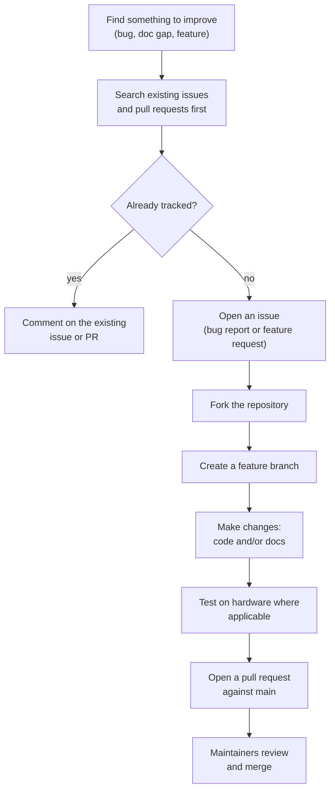
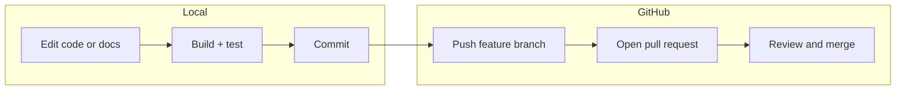

# Contributing

Thanks for your interest in this project. It is a community copy of an
STMicroelectronics example (Dual IPv4 and IPv6 UDP with NetX Duo on
NUCLEO-H743) with added user features, so a few ground rules keep the
repository healthy.

> **Note**: This example is delivered as-is and is not an officially supported
> ST product. For STM32 product questions (hardware, tools, drivers), use the
> [ST Community](https://community.st.com/s/topic/0TO0X000000BSqSWAW/stm32-mcus).

---

## 1. How to contribute

---

## 2. Opening an issue

Use the issue templates in `.github/ISSUE_TEMPLATE/`:

* **Bug report**: describe the exact steps, the expected behavior, the actual
  behavior, the console output, and your network configuration.
* **Feature request**: describe the problem you are solving, the proposed
  behavior, and any alternatives.

Good bug reports include:

* Board, tools, and firmware revision (use `git rev-parse HEAD`).
* Your edited values for IP addresses, ports, and pool sizes.
* The full serial console transcript.
* Packet Sender or `nc` commands you used.

---

## 3. Opening a pull request

Keep PRs small and focused:

1. **Branch**: create a branch off `main`, e.g. `fix/ipv6-prefix-typo`.
2. **Commits**: use clear commit messages in the imperative mood
   ("Fix typo in IPv6 prefix", "Document LED command grammar").
3. **Docs**: update the relevant guide in `docs/` if behavior or
   configuration changes.
4. **Flowcharts**: when documenting flows, use Mermaid `flowchart` blocks so
   they render on GitHub.
5. **No em dashes**: this repository's documentation uses hyphens, commas, or
   parentheses instead of the em dash character.
6. **Style**: follow the CubeMX `USER CODE` block conventions in generated
   files; keep regenerable code separated from hand-written code.

### PR checklist

* [ ] The change builds (STM32CubeIDE or `make -C Debug`).
* [ ] The change was tested on a NUCLEO-H743ZI2 where applicable.
* [ ] `docs/` updated for configuration, protocol, or behavior changes.
* [ ] No em dash characters in markdown.
* [ ] No generated build artifacts (`Debug/`, `*.o`, `*.elf`) in the diff.

---

## 4. Development workflow

---

## 5. Code of conduct

Be respectful and constructive. See [CODE_OF_CONDUCT.md](CODE_OF_CONDUCT.md)
for the full text.

## 6. Security

Do not report security vulnerabilities through public issues. See
[SECURITY.md](SECURITY.md) for the reporting process.
