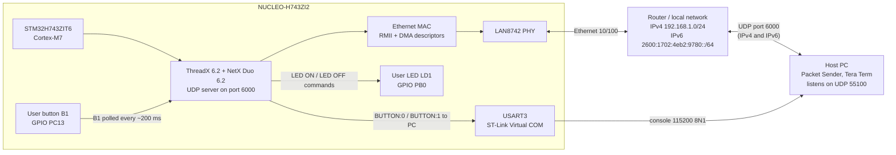
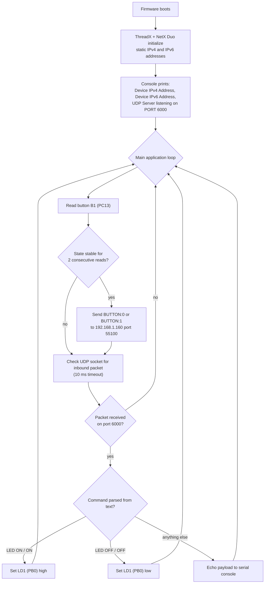
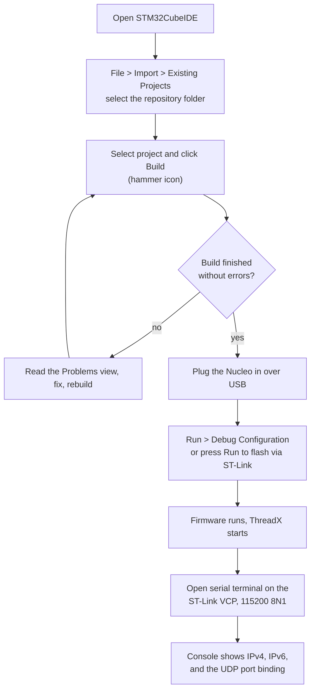
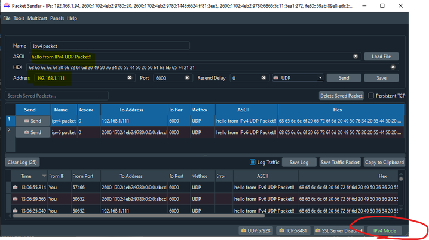
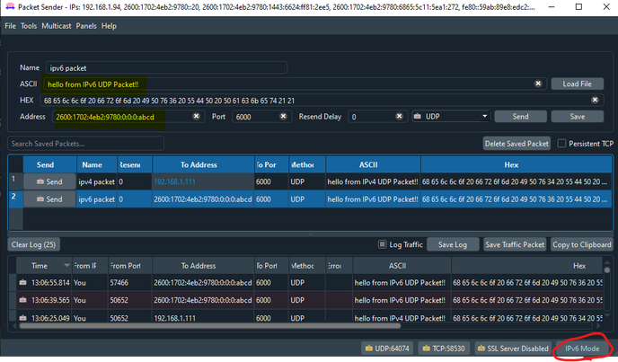

# Dual IPv4 and IPv6 UDP with NetX Duo on NUCLEO-H743

An STM32CubeIDE firmware example for the **NUCLEO-H743ZI2** board (STM32H743ZIT6, Cortex-M7)
that runs **Azure RTOS ThreadX 6.2** with **NetX Duo 6.2** and provides:

* A **UDP server** bound to port **6000** that listens on **both IPv4 and IPv6**.
  Incoming UDP text commands control the green user LED (LD1, PB0).
* A **UDP button reporter** that polls the user button (B1, PC13) with software
  debouncing and streams `BUTTON:0` / `BUTTON:1` messages to a host PC.
* A **serial debug console** on the ST-Link Virtual COM port (USART3, 115200 8N1)
  that prints the assigned IPv4 and IPv6 addresses and every received packet.

The project is generated from STM32CubeMX (`.ioc` included), so the peripheral
initialization, linker script, and startup code are all open for inspection and
regeneration. IPv6 support is enabled manually in `app_netxduo.c` because
STM32CubeMX does not generate it by default.

---

## Table of contents

* [System overview](#system-overview)
* [Features](#features)
* [Repository layout](#repository-layout)
* [Quick start](#quick-start)
* [Default network configuration](#default-network-configuration)
* [UDP protocol in one screen](#udp-protocol-in-one-screen)
* [Documentation](#documentation)
* [Troubleshooting](#troubleshooting)
* [License](#license)

---

## System overview



### What happens at runtime



---

## Features

* **Dual-stack UDP** with one socket bound to port 6000 for IPv4 and IPv6.
* **Static IPv4** addressing: `192.168.1.111 / 255.255.255.0`.
* **Static IPv6** global address: `2600:1702:4eb2:9780::abcd/64` (link-local is
  auto-assigned from the MAC address).
* **LED remote control** over UDP with a forgiving parser:
  `LED ON`, `LED_ON`, `LEDON`, `ON` (and lowercase variants) turn LD1 on;
  `LED OFF`, `OFF` (and lowercase variants) turn it off.
* **Button state reporting**: B1 is polled with a 2-read software debounce and
  reported as `BUTTON:0` (pressed) or `BUTTON:1` (released) roughly every 200 ms.
* **Serial console**: prints addresses, port binding, sent packets, and all
  received payloads at 115200 baud over the ST-Link Virtual COM port.
* **CubeMX project**: full `.ioc` file, linker scripts, startup code, and HAL
  configuration included; IPv6 setup documented step by step in `docs/`.
* **Azure RTOS components**: ThreadX kernel, byte memory pools, one application
  thread, NetX Duo packet pool, ARP, ICMP/ICMPv6, TCP, UDP, and the STM32
  Ethernet driver integration.

---

## Repository layout

```
.
├── AZURE_RTOS/
│   └── App/                          # Azure RTOS application layer
│       ├── app_azure_rtos.c          # tx_application_define: creates pools, boots apps
│       ├── app_azure_rtos.h
│       └── app_azure_rtos_config.h   # static allocation and memory pool sizes
├── Core/
│   ├── Inc/                          # app_threadx.h, main.h, HAL config, IT header
│   └── Src/                          # main.c, app_threadx.c, HAL, startup support
├── Drivers/                          # CMSIS, STM32H7xx HAL, BSP (LAN8742 PHY)
├── Middlewares/                      # Azure RTOS ThreadX and NetX Duo sources
├── NetXDuo/
│   └── App/
│       ├── app_netxduo.c             # network init + UDP application thread
│       ├── app_netxduo.h             # IP address, mask, pool and thread sizes
│       └── nx_user.h                 # NetX Duo build configuration
├── docs/                             # full documentation, all with flowcharts
├── images/                           # Packet Sender screenshots
├── Debug/                            # STM32CubeIDE build output (not source)
├── NUCLEO_H743_NetXDuo_UDP_IPv4_IPv6.ioc   # STM32CubeMX project file
├── STM32H743ZITX_FLASH.ld            # linker script for flash execution
├── STM32H743ZITX_RAM.ld              # linker script for RAM execution
└── *.launch                          # STM32CubeIDE debug configurations
```

---

## Quick start

### 1. What you need

* A [NUCLEO-H743ZI2](https://www.st.com/en/evaluation-tools/nucleo-h743zi.html) board.
* [STM32CubeIDE](https://www.st.com/en/development-tools/stm32cubeide.html)
  (the project was generated with STM32CubeMX 6.15.0).
* A USB cable (the Nucleo provides power, ST-Link debugging, and the VCP).
* A serial terminal (Tera Term, PuTTY, or the STM32CubeIDE terminal).
* A UDP test tool such as
  [Packet Sender](https://packetsender.com/) or any Python/netcat one-liner.

### 2. Build and flash



Full step-by-step instructions, including command-line builds with the generated
`Debug/makefile` and regenerating the project from the `.ioc`, are in
[docs/BUILDING.md](docs/BUILDING.md).

### 3. Test UDP

* Connect a serial terminal to the ST-Link Virtual COM port at **115200 baud**.
* On first boot the firmware prints its addresses:

  ```
  Device IPv4 Address: 192.168.1.111
  Device IPv6 Address: 2600:1702:4eb2:9780:0:0:0:abcd
  UDP Server listening on PORT 6000..
  ```

* From a machine on the same network, send a UDP packet to the board:
  * IPv4: destination `192.168.1.111`, port `6000`, payload `LED ON`.
  * IPv6: destination `2600:1702:4eb2:9780::abcd`, port `6000`, payload `LED OFF`.
* The green LED LD1 toggles and the payload is echoed on the serial console.
* Pressing B1 sends `BUTTON:0` / `BUTTON:1` to `192.168.1.160:55100`, so run a
  UDP listener on the PC (Packet Sender "Server" mode or `nc -u -l 55100`).

    
    

See [docs/TESTING.md](docs/TESTING.md) for a full test matrix and
[docs/PROTOCOL.md](docs/PROTOCOL.md) for the message reference.

---

## Default network configuration

| Setting | Value | Where to change it |
|:--------|:------|:-------------------|
| IPv4 address | `192.168.1.111` | `NetXDuo/App/app_netxduo.h`, line 87 |
| IPv4 netmask | `255.255.255.0` | `NetXDuo/App/app_netxduo.h`, line 89 |
| IPv6 global address | `2600:1702:4eb2:9780::abcd/64` | `NetXDuo/App/app_netxduo.c`, lines 265 to 268 |
| UDP listen port | `6000` | `NetXDuo/App/app_netxduo.c`, line 323 |
| PC target for button reports | `192.168.1.160`, port `55100` | `NetXDuo/App/app_netxduo.c`, lines 306 and 365 |
| MAC address | `00:80:E1:00:00:00` | `Core/Src/main.c`, lines 229 to 234 |
| Serial console | USART3, 115200 8N1 | `Core/Src/main.c`, line 276 |

Every knob, including memory pool sizes, thread priorities, debounce settings,
and send cadence, is documented in [docs/CONFIGURATION.md](docs/CONFIGURATION.md).

---

## UDP protocol in one screen

| Direction | Port | Payload examples | Effect |
|:----------|:-----|:-----------------|:-------|
| PC to board | 6000 | `LED ON`, `LED_ON`, `LEDON`, `ON`, lowercase variants | Green LED LD1 on |
| PC to board | 6000 | `LED OFF`, `OFF`, lowercase variants | Green LED LD1 off |
| PC to board | 6000 | anything else | Payload echoed to the serial console |
| Board to PC | 55100 | `BUTTON:0` | B1 is pressed |
| Board to PC | 55100 | `BUTTON:1` | B1 is released |

---

## Documentation

The `docs/` folder is a complete, fully detailed documentation set. Every
guide uses Mermaid flowcharts that render on GitHub.

| Document | What it covers |
|:---------|:---------------|
| [docs/ARCHITECTURE.md](docs/ARCHITECTURE.md) | System diagram, software stack, thread model, memory map, interrupts |
| [docs/SYSTEM_CLOCK.md](docs/SYSTEM_CLOCK.md) | Clock source, PLL math, bus dividers, HAL time base |
| [docs/MEMORY_LAYOUT.md](docs/MEMORY_LAYOUT.md) | Linker script, RAM regions, special sections, MPU, map file |
| [docs/GPIO_AND_BOARD.md](docs/GPIO_AND_BOARD.md) | Board features, LED/button config, RMII pins, serial wiring |
| [docs/AZURE_RTOS_OVERVIEW.md](docs/AZURE_RTOS_OVERVIEW.md) | ThreadX and NetX Duo concepts used by this firmware |
| [docs/IPV6_AND_NETWORKING.md](docs/IPV6_AND_NETWORKING.md) | IPv6 configuration, address words, dual-stack behavior, testing |
| [docs/BUILDING.md](docs/BUILDING.md) | Import, build, flash, debug, CLI build, CubeMX regeneration |
| [docs/CONFIGURATION.md](docs/CONFIGURATION.md) | Every configurable parameter with file and line references |
| [docs/PROTOCOL.md](docs/PROTOCOL.md) | Full UDP message reference with decision flowcharts |
| [docs/CODE_WALKTHROUGH.md](docs/CODE_WALKTHROUGH.md) | Annotated tour of main.c, app_azure_rtos.c, app_netxduo.c |
| [docs/API_REFERENCE.md](docs/API_REFERENCE.md) | Every application and middleware function signature used |
| [docs/TESTING.md](docs/TESTING.md) | Test matrix, expected serial output, verification flow |
| [docs/DEBUGGING.md](docs/DEBUGGING.md) | Breakpoints, watch expressions, hard fault analysis |
| [docs/TROUBLESHOOTING.md](docs/TROUBLESHOOTING.md) | Common problems and their fixes |
| [docs/EXTENDING.md](docs/EXTENDING.md) | Adding threads, TCP, DHCP, more sockets, link-local testing |
| [docs/FAQ.md](docs/FAQ.md) | Frequently asked questions |
| [docs/GLOSSARY.md](docs/GLOSSARY.md) | Terms used throughout the repository |

Start at [docs/README.md](docs/README.md), which maps how the guides fit
together and the suggested reading order.

---

## Troubleshooting

The most common issues are network related: the board uses a **static IPv4
address**, so it must match the subnet of your router, and the **IPv6 global
address is hard-coded** to the subnet of the original developer's router, so it
almost certainly needs to be edited for your network.

See [docs/TROUBLESHOOTING.md](docs/TROUBLESHOOTING.md) for details, including
link-up checks, ARP verification, and how to pick IPv6 addresses that your
router will route.

---

## License

The firmware is built from STMicroelectronics example code. Component licenses
are listed in [LICENSE.md](LICENSE.md) (HAL: BSD-3-Clause, CMSIS: Apache-2.0,
Azure RTOS ThreadX/NetX Duo: Microsoft Azure RTOS license terms).

See [CONTRIBUTING.md](CONTRIBUTING.md) for how to report issues and propose
changes, and [SECURITY.md](SECURITY.md) for reporting security vulnerabilities.
