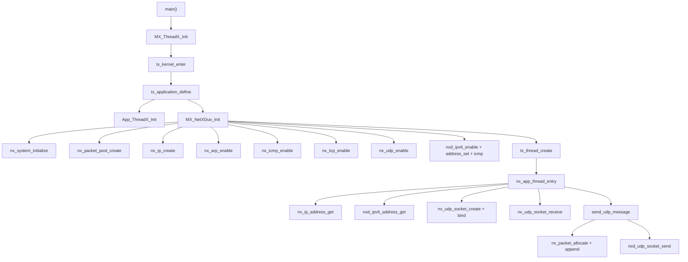

# API reference

Every application-level function and every middleware call used by this
project, with signatures taken from the repository headers
(`Middlewares/ST/netxduo/common/inc/*.h` and
`Middlewares/ST/threadx/common/inc/tx_api.h`). Return value `NX_SUCCESS`
equals 0; any other value is an error code (see the header files for the full
enum).

---

## 1. Application-level functions

### `void MX_ThreadX_Init(void)`

| | |
|:--|:--|
| Defined in | `Core/Src/app_threadx.c` |
| Purpose | Enters the ThreadX kernel; never returns on success |
| Called from | `main()` |
| Flow | `tx_kernel_enter()` starts the scheduler; `tx_application_define` runs first |

### `UINT App_ThreadX_Init(VOID *memory_ptr)`

| | |
|:--|:--|
| Defined in | `Core/Src/app_threadx.c` |
| Purpose | Application ThreadX bootstrap hook; empty in this project |
| Called from | `tx_application_define` (app_azure_rtos.c) |

### `VOID tx_application_define(VOID *first_unused_memory)`

| | |
|:--|:--|
| Defined in | `AZURE_RTOS/App/app_azure_rtos.c` |
| Purpose | Creates the two byte pools and calls `App_ThreadX_Init` then `MX_NetXDuo_Init` |
| Called from | ThreadX before scheduling |

### `UINT MX_NetXDuo_Init(VOID *memory_ptr)`

| | |
|:--|:--|
| Defined in | `NetXDuo/App/app_netxduo.c` |
| Purpose | Initializes NetX Duo: system, packet pool, IP instance, protocols, IPv6, thread |
| Called from | `tx_application_define` |
| Returns | `NX_SUCCESS` or an error code |
| Flow | see [ARCHITECTURE.md](ARCHITECTURE.md) section 3 |

### `void send_udp_message(NXD_ADDRESS *destination, UINT port, char *message)`

| | |
|:--|:--|
| Defined in | `NetXDuo/App/app_netxduo.c`, lines 86 to 111 |
| Purpose | Allocates a UDP packet, appends `message`, sends it to `destination:port` |
| Notes | releases the packet on any failure; prints `Sent: <message>` on success |

### `void printIPv6(NXD_ADDRESS ipv6)`

| | |
|:--|:--|
| Defined in | `NetXDuo/App/app_netxduo.c`, lines 67 to 79 |
| Purpose | Prints an IPv6 address as 8 colon-separated 16-bit groups |

### `PRINT_IP_ADDRESS(addr)` (macro)

| | |
|:--|:--|
| Defined in | `NetXDuo/App/app_netxduo.c`, `USER CODE PD` block |
| Purpose | Prints a 32-bit IPv4 address in dotted decimal |

---

## 2. ThreadX kernel APIs

### `VOID tx_kernel_enter(VOID)`

| | |
|:--|:--|
| Purpose | Starts the ThreadX kernel. Does not return |

### `UINT tx_byte_pool_create(TX_BYTE_POOL *pool_ptr, CHAR *name_ptr, VOID *start_address, ULONG pool_size)`

| | |
|:--|:--|
| Used at | `app_azure_rtos.c` (two pools) |
| Returns | `TX_SUCCESS` or error |

### `UINT tx_byte_allocate(TX_BYTE_POOL *pool_ptr, VOID **memory_ptr, ULONG memory_size, ULONG wait_option)`

| | |
|:--|:--|
| Used at | `MX_NetXDuo_Init` for packet pool, stacks, ARP cache |
| Returns | `TX_SUCCESS` or error (e.g. `TX_NO_MEMORY`) |

### `UINT tx_thread_create(TX_THREAD *thread_ptr, CHAR *name_ptr, VOID (*entry_function)(ULONG), ULONG entry_input, VOID *stack_start, ULONG stack_size, UINT priority, UINT preempt_threshold, ULONG time_slice, UINT auto_start)`

| | |
|:--|:--|
| Used at | `MX_NetXDuo_Init` for `nx_app_thread_entry` |
| Values used | priority 10, preempt 10, no time slice, auto start |

### `UINT tx_thread_sleep(ULONG timer_ticks)`

| | |
|:--|:--|
| Used at | `nx_app_thread_entry`, 20 ticks = ~200 ms |
| Returns | `TX_SUCCESS` when the sleep completes |

---

## 3. NetX Duo core APIs

### `VOID nx_system_initialize(VOID)`

| | |
|:--|:--|
| Purpose | One-time NetX Duo initialization; call before any other NetX API |

### `UINT nx_packet_pool_create(NX_PACKET_POOL *pool_ptr, CHAR *name, ULONG payload_size, VOID *memory_ptr, ULONG memory_size)`

| | |
|:--|:--|
| Used at | `MX_NetXDuo_Init`, payload 1536, memory `NX_APP_PACKET_POOL_SIZE` |

### `UINT nx_ip_create(NX_IP *ip_ptr, CHAR *name, ULONG ip_address, ULONG network_mask, NX_PACKET_POOL *default_pool, VOID (*ip_link_driver)(NX_IP_DRIVER *), VOID *memory_ptr, ULONG memory_size, UINT priority)`

| | |
|:--|:--|
| Used at | `MX_NetXDuo_Init` with `nx_stm32_eth_driver`, 2 KB stack, priority 10 |

### `UINT nx_arp_enable(NX_IP *ip_ptr, VOID *arp_cache_memory, ULONG arp_cache_size)`

| | |
|:--|:--|
| Used at | `MX_NetXDuo_Init`, 1024 byte cache |

### `UINT nx_icmp_enable(NX_IP *ip_ptr)` / `UINT nxd_icmp_enable(NX_IP *ip_ptr)`

| | |
|:--|:--|
| Purpose | IPv4 ping / IPv6 ping (ICMPv6) support |

### `UINT nx_tcp_enable(NX_IP *ip_ptr)` / `UINT nx_udp_enable(NX_IP *ip_ptr)`

| | |
|:--|:--|
| Purpose | Enables the TCP and UDP protocol engines |

### `UINT nx_ip_address_get(NX_IP *ip_ptr, ULONG *ip_address, ULONG *network_mask)`

| | |
|:--|:--|
| Used at | `nx_app_thread_entry` to print IPv4 |

### `UINT nxd_ipv6_enable(NX_IP *ip_ptr)`

| | |
|:--|:--|
| Used at | `MX_NetXDuo_Init` USER CODE block |

### `UINT nxd_ipv6_address_set(NX_IP *ip_ptr, UINT interface_index, NXD_ADDRESS *ip_address, ULONG prefix_length, UINT *address_index)`

| | |
|:--|:--|
| Used at | `MX_NetXDuo_Init`; interface 0, `2600:1702:4eb2:9780::abcd`, `/64`, index `NX_NULL` |

### `UINT nxd_ipv6_address_get(NX_IP *ip_ptr, UINT address_index, NXD_ADDRESS *ip_address, ULONG *prefix_length, UINT *interface_index)`

| | |
|:--|:--|
| Used at | `nx_app_thread_entry` to print IPv6 (index 0) |

---

## 4. UDP socket APIs

### `UINT nx_udp_socket_create(NX_IP *ip_ptr, NX_UDP_SOCKET *socket_ptr, CHAR *name, ULONG type_of_service, ULONG fragment, UINT time_to_live, ULONG queue_maximum)`

| | |
|:--|:--|
| Used at | `nx_app_thread_entry`, queue maximum 512 packets |
| Type of service | `NX_IP_NORMAL` |
| Fragmentation | `NX_FRAGMENT_OKAY` |
| TTL | `NX_IP_TIME_TO_LIVE` |

### `UINT nx_udp_socket_bind(NX_UDP_SOCKET *socket_ptr, UINT port, ULONG wait_option)`

| | |
|:--|:--|
| Used at | `nx_app_thread_entry`, port 6000, `TX_WAIT_FOREVER` |

### `UINT nx_udp_socket_receive(NX_UDP_SOCKET *socket_ptr, NX_PACKET **packet_ptr, ULONG wait_option)`

| | |
|:--|:--|
| Used at | `nx_app_thread_entry`, wait 1 tick |

### `UINT nxd_udp_socket_send(NX_UDP_SOCKET *socket_ptr, NX_PACKET *packet_ptr, NXD_ADDRESS *ip_address, UINT port)`

| | |
|:--|:--|
| Used at | `send_udp_message`, destination any version (NXD_ADDRESS) |

The `NXD_ADDRESS` structure is the dual-stack address type:

```c
typedef struct NXD_ADDRESS_STRUCT
{
  ULONG nxd_ip_version;              /* NX_IP_VERSION_V4 or NX_IP_VERSION_V6 */
  union {
    ULONG v4;                        /* IPv4 address */
    ULONG v6[4];                     /* IPv6 address, four 32-bit words */
  } nxd_ip_address;
} NXD_ADDRESS;
```

---

## 5. Packet APIs

### `UINT nx_packet_allocate(NX_PACKET_POOL *pool_ptr, NX_PACKET **packet_ptr, ULONG packet_type, ULONG wait_option)`

| | |
|:--|:--|
| Used at | `send_udp_message` with `NX_UDP_PACKET`, `TX_NO_WAIT` |

### `UINT nx_packet_data_append(NX_PACKET *packet_ptr, VOID *data_start, ULONG data_size, NX_PACKET_POOL *pool_ptr, ULONG wait_option)`

| | |
|:--|:--|
| Used at | `send_udp_message` to copy the message into the packet |

### `UINT nx_packet_data_retrieve(NX_PACKET *packet_ptr, VOID *buffer_start, ULONG *bytes_copied)`

| | |
|:--|:--|
| Used at | `nx_app_thread_entry` to copy the received payload into `data_buffer` |

### `UINT nx_packet_release(NX_PACKET *packet_ptr)`

| | |
|:--|:--|
| Used at | error paths and after processing a received packet |

---

## 6. Call graph



Related: [CODE_WALKTHROUGH.md](CODE_WALKTHROUGH.md) for the annotated source,
[AZURE_RTOS_OVERVIEW.md](AZURE_RTOS_OVERVIEW.md) for the concepts.
