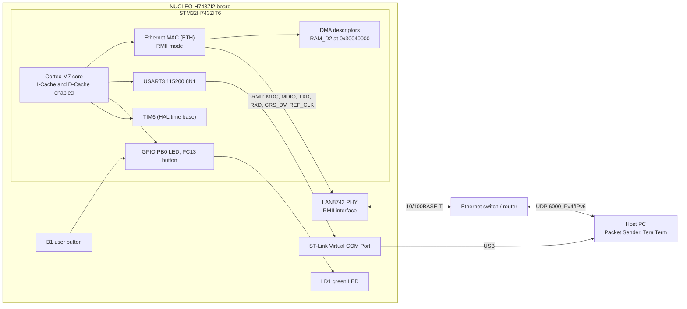
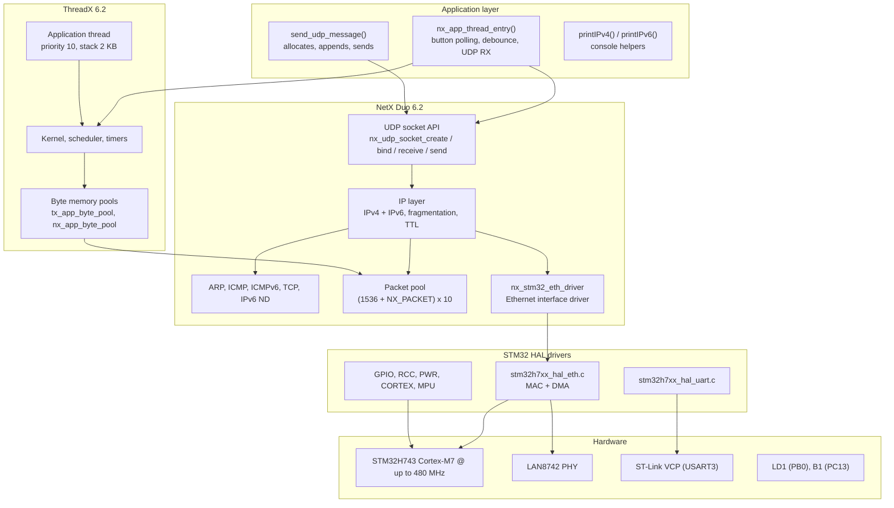
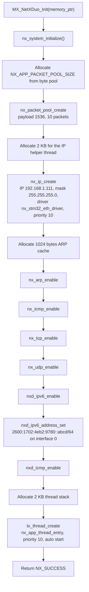
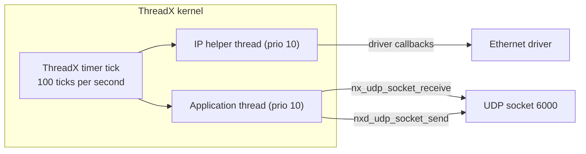
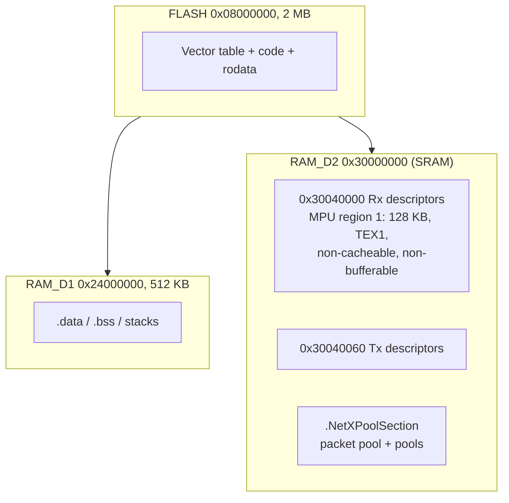

# Architecture

This document explains how the firmware is structured: the system diagram, the
software stack, the boot and initialization flow, the thread model, the memory
map, and the interrupt setup. All diagrams use Mermaid flowcharts and render on
GitHub.

---

## 1. System diagram

Pin mapping for the RMII interface (from the `.ioc` and `MX_GPIO_Init`):

| Signal | Pin | Signal | Pin |
|:-------|:----|:-------|:----|
| RMII_REF_CLK | PA1 | RMII_TXD0 | PG13 |
| RMII_MDIO | PA2 | RMII_TXD1 | PB13 |
| RMII_CRS_DV | PA7 | RMII_TX_EN | PG11 |
| RMII_MDC | PC1 | RMII_RXD0 | PC4 |
| USART3_TX | PD8 | RMII_RXD1 | PC5 |
| USART3_RX | PD9 | HSE clock | PH0 |

---

## 2. Software stack

Key include path: `app_netxduo.h` pulls in `nx_api.h` and
`nx_stm32_eth_driver.h`; `app_azure_rtos.h` pulls in `app_threadx.h` and
`app_netxduo.h`, so the application layer sees the whole stack.

---

## 3. Boot and initialization flow

```mermaid
flowchart TD
    PWR["Power on / reset"] --> RST["Reset_Handler<br/>(startup_stm32h743zitx.s)"]
    RST --> SYSI["SystemInit()<br/>(system_stm32h7xx.c)"]
    SYSI --> MAIN["main() in Core/Src/main.c"]
    MAIN --> MPU["MPU_Config()<br/>region 1: 128 KB non-cacheable<br/>at 0x30040000 for DMA descriptors"]
    MPU --> CACHE["SCB_EnableICache()<br/>SCB_EnableDCache()"]
    CACHE --> HALI["HAL_Init()<br/>HAL time base = TIM6"]
    HALI --> CLK["SystemClock_Config()<br/>HSE bypass, PLL, dividers"]
    CLK --> GPIO["MX_GPIO_Init()<br/>LD1 PB0, LD2 PB7, LD3 PB14, B1 PC13"]
    GPIO --> ETHI["MX_ETH_Init()<br/>MAC 00:80:E1:00:00:00, RMII,<br/>RxBuf 1536, TX checksum + CRC pad"]
    ETHI --> UART["MX_USART3_UART_Init()<br/>115200 8N1, TX/RX FIFO"]
    UART --> TXI["MX_ThreadX_Init()"]
    TXI --> KERN["tx_kernel_enter()<br/>(never returns)"]
    KERN --> DEF["tx_application_define()<br/>in app_azure_rtos.c"]
    DEF --> POOL1["tx_byte_pool_create<br/>tx_app_byte_pool (1 KB)"]
    POOL1 --> APP1["App_ThreadX_Init()"]
    APP1 --> POOL2["tx_byte_pool_create<br/>nx_app_byte_pool (30 KB)"]
    POOL2 --> NXINIT["MX_NetXDuo_Init()<br/>in app_netxduo.c"]
    NXINIT --> SCHED["Scheduler starts the<br/>NetX Duo app thread"]
```

### What `MX_NetXDuo_Init()` does, step by step

---

## 4. Thread model

The application is single-threaded on top of the ThreadX kernel. The kernel
itself runs a helper thread for the IP instance (priority 10) plus the timer
infrastructure.

| Thread | Created by | Priority | Stack | Entry point |
|:-------|:-----------|:---------|:------|:------------|
| IP helper (inside `NX_IP`) | `nx_ip_create` | 10 | 2 KB | internal NetX Duo code |
| Application thread | `tx_thread_create` | 10 | 2 KB | `nx_app_thread_entry` |

Both threads share priority 10 and run round-robin in time-slice-free mode;
the application thread yields with `tx_thread_sleep()` and short blocking calls,
so the IP helper always gets CPU time for incoming traffic.

---

## 5. Memory map

The linker script `STM32H743ZITX_FLASH.ld` targets 2 MB flash and 512 KB of
RAM_D1. The Ethernet DMA descriptors and the NetX Duo packet pool are placed in
RAM_D2 via dedicated sections:

| Region | Address | Size | Contents |
|:-------|:--------|:-----|:---------|
| FLASH | `0x08000000` | 2 MB | Vector table, code, constants |
| RAM_D1 | `0x24000000` | 512 KB | `.data`, `.bss`, stacks, heaps |
| RAM_D2 | `0x30000000` | (section) | `.RxDecripSection`, `.TxDecripSection`, `.NetXPoolSection` |
| Rx DMA descriptors | `0x30040000` | 96 bytes | `DMARxDscrTab[ETH_RX_DESC_CNT]` |
| Tx DMA descriptors | `0x30040060` | 96 bytes | `DMATxDscrTab[ETH_TX_DESC_CNT]` |

Why non-cacheable? The DMA engine writes received Ethernet frames into memory.
If the CPU's D-Cache were enabled for that region, the CPU could read stale
cached data. The MPU marks the descriptor region (and the `.NetXPoolSection` is
handled by the `nx_stm32_eth_driver` with cache maintenance) so DMA and CPU see
consistent data.

Static memory pools defined in `app_azure_rtos.c`:

* `tx_byte_pool_buffer[TX_APP_MEM_POOL_SIZE]`, `TX_APP_MEM_POOL_SIZE = 1024` bytes.
* `nx_byte_pool_buffer[NX_APP_MEM_POOL_SIZE]`, `NX_APP_MEM_POOL_SIZE = 30 KB`,
  placed in the `.NetXPoolSection` (RAM_D2).

---

## 6. Interrupts and timing

| Source | Role |
|:-------|:-----|
| ETH IRQ | Ethernet MAC interrupt; the NetX Duo driver defers packet processing to the IP helper thread (`NX_DRIVER_DEFERRED_PROCESSING`) |
| TIM6 | HAL time base: `HAL_TIM_PeriodElapsedCallback` calls `HAL_IncTick()` |
| SysTick | ThreadX timer tick (100 ticks per second) |
| PendSV / SVCall | ThreadX context switching |

Timing constants used by the application thread:

| Constant | Value | Meaning |
|:---------|:------|:--------|
| `NX_IP_PERIODIC_RATE` | 100 ticks/s | one tick = 10 ms |
| `SEND_SLEEP_TICKS` | `NX_IP_PERIODIC_RATE / 5` = 20 ticks | button report every ~200 ms |
| receive timeout | 1 tick | non-blocking-ish UDP receive poll |

---

## 7. Where the code lives

| Concern | File |
|:--------|:-----|
| Hardware init (MPU, clock, ETH, USART3, GPIO) | `Core/Src/main.c` |
| ThreadX kernel entry | `Core/Src/app_threadx.c` |
| Memory pools and application bootstrap | `AZURE_RTOS/App/app_azure_rtos.c` |
| Network stack init and UDP application thread | `NetXDuo/App/app_netxduo.c` |
| Network constants (IP, mask, sizes) | `NetXDuo/App/app_netxduo.h` |
| NetX Duo build options (IPv6 enabled) | `NetXDuo/App/nx_user.h` |
| Pool sizes | `AZURE_RTOS/App/app_azure_rtos_config.h` |
| Linker layout | `STM32H743ZITX_FLASH.ld` |

Continue to [BUILDING.md](BUILDING.md) to compile and flash, or
[CONFIGURATION.md](CONFIGURATION.md) to tune every setting.
