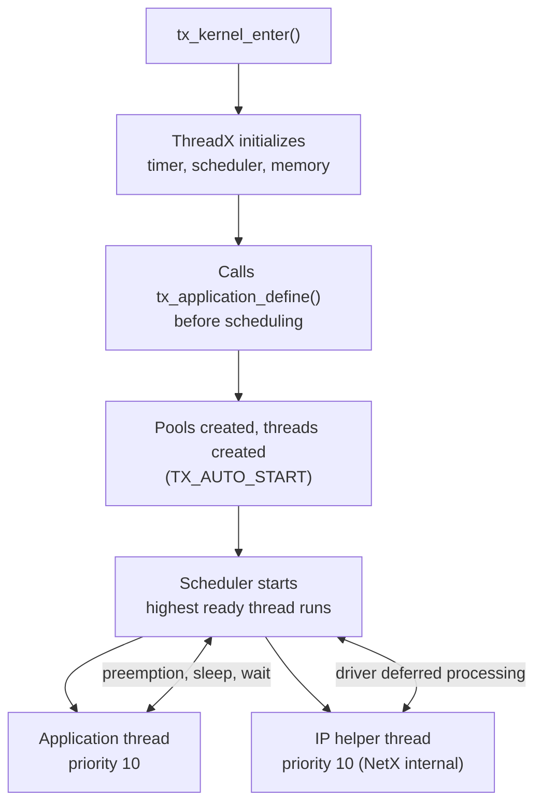
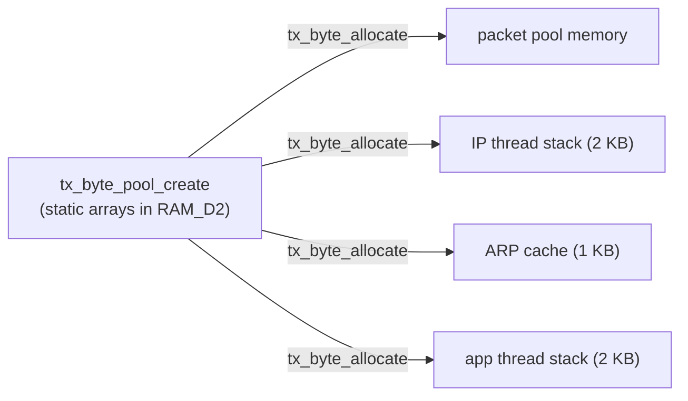
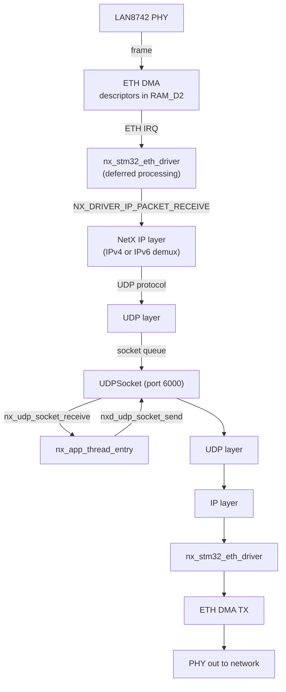
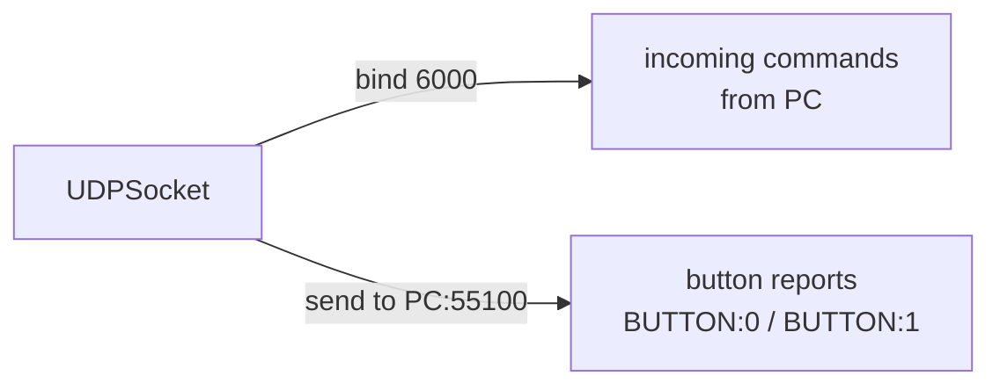
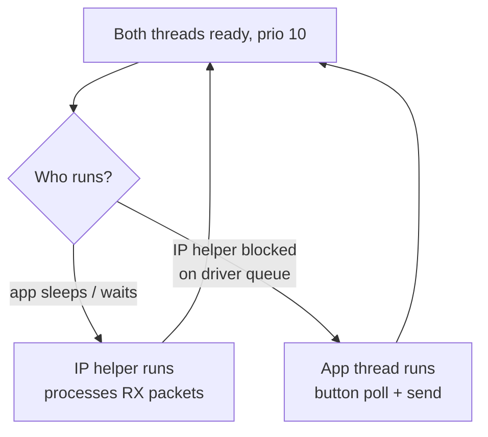
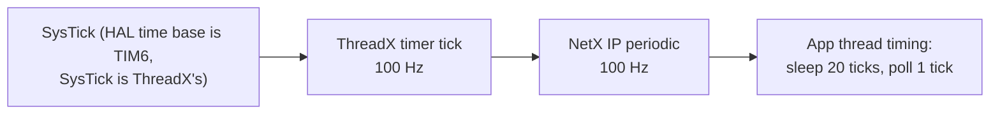

# Azure RTOS (ThreadX + NetX Duo) overview

This project runs **Azure RTOS ThreadX 6.2** as the real-time kernel and
**NetX Duo 6.2** as the TCP/IP stack. This document explains the kernel and
network concepts used here, in the context of the actual code, so you can
reason about the firmware without reading the middleware sources first.

---

## 1. ThreadX: the kernel

ThreadX is a preemptive priority-based RTOS. The pieces used in this project:

| Concept | Used in this project |
|:--------|:---------------------|
| Kernel entry | `tx_kernel_enter()` called from `MX_ThreadX_Init()` |
| Application definition | `tx_application_define()` in `app_azure_rtos.c` |
| Threads | one application thread (`nx_app_thread_entry`) |
| Byte memory pools | `tx_app_byte_pool` (1 KB), `nx_app_byte_pool` (30 KB) |
| Timing | `tx_thread_sleep()`, timer tick = 10 ms |
| Priorities | both threads at priority 10 |

### Thread lifecycle

### Byte pools vs thread stacks

All dynamic memory comes from byte pools (no `malloc`):

If any allocation fails, the firmware returns an error code and eventually
hangs in `Error_Handler()`.

---

## 2. NetX Duo: the network stack

NetX Duo is a dual-stack (IPv4 + IPv6) TCP/IP implementation that runs on top
of ThreadX. Components created by `MX_NetXDuo_Init`:

| Component | Created by | Purpose |
|:----------|:-----------|:--------|
| System | `nx_system_initialize()` | stack-wide init |
| Packet pool | `nx_packet_pool_create()` | 10 packets, 1536 byte payload |
| IP instance | `nx_ip_create()` | IPv4/IPv6 endpoint, link driver |
| ARP | `nx_arp_enable()` | IPv4 address resolution |
| ICMP | `nx_icmp_enable()` | IPv4 ping support |
| TCP | `nx_tcp_enable()` | TCP protocol engine |
| UDP | `nx_udp_enable()` | UDP protocol engine |
| IPv6 | `nxd_ipv6_enable()` | IPv6 protocol engine |
| ICMPv6 | `nxd_icmp_enable()` | IPv6 ping (ping6) support |
| Socket | `nx_udp_socket_create()` | the application UDP socket |

### Packet flow through the stack

Key design point: `NX_DRIVER_DEFERRED_PROCESSING` is defined in
`nx_user.h`, so received packets are queued to the IP helper thread instead of
being processed inside the Ethernet ISR. This keeps interrupt latency low and
makes the application thread (which also calls receive) safe.

---

## 3. The socket model

The application uses one UDP socket for both directions:

| Role | API call | Port |
|:-----|:---------|:-----|
| Create | `nx_udp_socket_create(&NetXDuoEthIpInstance, &UDPSocket, ...)` | - |
| Bind (server) | `nx_udp_socket_bind(&UDPSocket, 6000, TX_WAIT_FOREVER)` | 6000 |
| Receive | `nx_udp_socket_receive(&UDPSocket, &pkt, 1)` | 6000 |
| Send | `nxd_udp_socket_send(&UDPSocket, pkt, &dest, 55100)` | 55100 (dest) |

A UDP socket is connectionless: the same socket both listens on 6000 and sends
from an ephemeral source port chosen by the stack. The PC sees button reports
from the board's IP with a dynamic source port.

---

## 4. Priorities and scheduling

| Thread | Priority | Preemption threshold | Time slice | Start |
|:-------|:---------|:---------------------|:-----------|:------|
| IP helper (internal) | 10 | 10 | none | auto |
| Application thread | 10 | 10 | none | auto |

Because both are priority 10, the ThreadX scheduler runs them round-robin only
when they block. The application thread blocks on `tx_thread_sleep()` (20
ticks) and on the 1-tick receive timeout, so the IP helper gets CPU time to
process incoming traffic.

---

## 5. Timers and tick rate

| Constant | Value | Defined in | Meaning |
|:---------|:------|:-----------|:--------|
| `TX_TIMER_TICKS_PER_SECOND` | 100 (default) | `Core/Inc/tx_user.h` (commented, default applies) | ThreadX tick rate |
| `NX_IP_PERIODIC_RATE` | `TX_TIMER_TICKS_PER_SECOND` | `NetXDuo/App/nx_user.h`, line 300 | NetX tick rate |
| `SEND_SLEEP_TICKS` | `NX_IP_PERIODIC_RATE / 5` = 20 | `app_netxduo.c`, line 331 | ~200 ms send cadence |
| receive timeout | 1 tick | `app_netxduo.c`, line 373 | 10 ms poll |

---

## 6. Where to go deeper

* [CODE_WALKTHROUGH.md](CODE_WALKTHROUGH.md) for how the calls fit together.
* [API_REFERENCE.md](API_REFERENCE.md) for every function signature used.
* [IPV6_AND_NETWORKING.md](IPV6_AND_NETWORKING.md) for the IPv6 specifics.
* [EXTENDING.md](EXTENDING.md) for adding threads, sockets, or DHCP.
