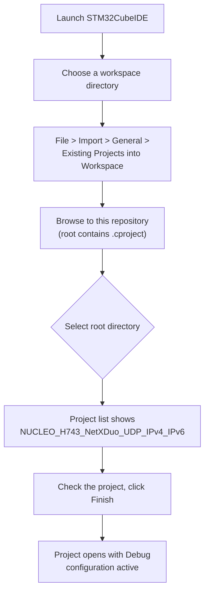
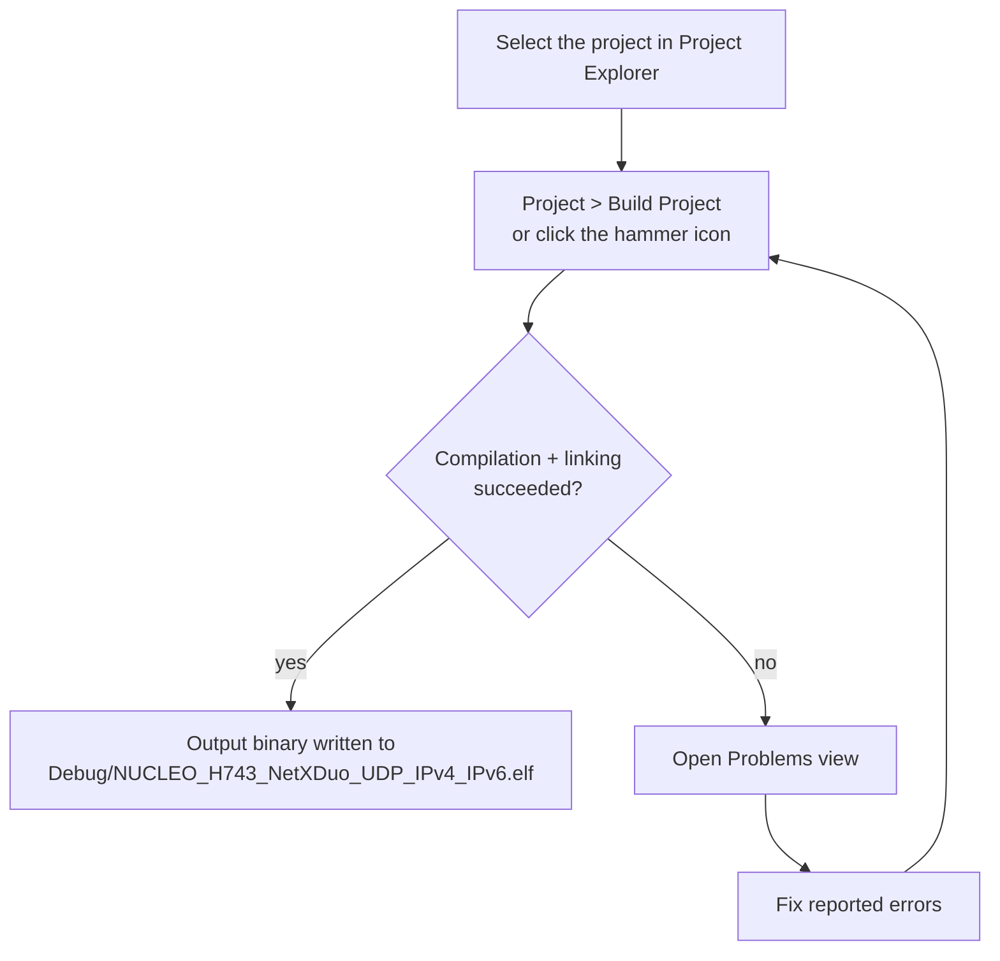
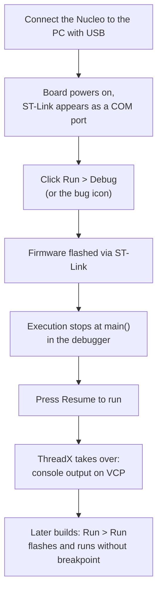
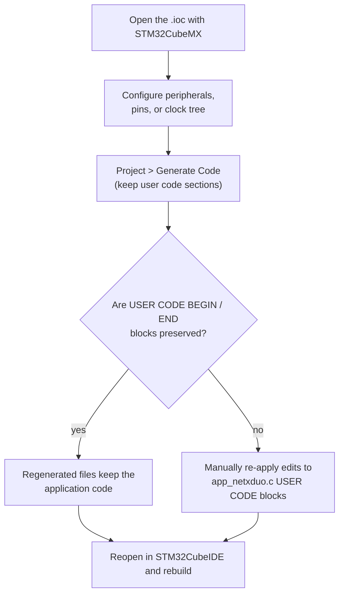

# Building and flashing

This project is an STM32CubeIDE project (created with CubeMX 6.15.0 /
X-CUBE-AZRTOS-H7 3.1.0). This document covers:

* importing and building with STM32CubeIDE,
* flashing and debugging with the on-board ST-Link,
* building from the command line with the generated makefile,
* regenerating the project from the `.ioc` file with CubeMX.

---

## 1. Prerequisites

| Tool | Purpose |
|:-----|:--------|
| [STM32CubeIDE](https://www.st.com/en/development-tools/stm32cubeide.html) | build, flash, debug |
| ST-Link driver | usually included with STM32CubeIDE on Windows |
| USB cable | power + ST-Link + Virtual COM port |
| Serial terminal | Tera Term, PuTTY, or the built-in terminal |

No external middleware download is needed: ThreadX and NetX Duo sources are
already in `Middlewares/` and the HAL/BSP drivers in `Drivers/`.

---

## 2. Import into STM32CubeIDE



If the repository is already in your workspace, use File > Open Projects from
File System instead.

---

## 3. Build



Notes:

* The default active build configuration is `Debug` (see the `.cproject`).
* The build produces `Debug/NUCLEO_H743_NetXDuo_UDP_IPv4_IPv6.elf`,
  `.hex`, `.bin`, `.map`, and `.list`.
* The linker uses `STM32H743ZITX_FLASH.ld`; the descriptors and packet pool are
  placed in RAM_D2 by dedicated output sections, so no manual section setup is
  needed.

---

## 4. Flash and debug



Alternatively, to flash without the debugger:

* Run > Run (flashes the ELF and launches).
* Or use STM32CubeProgrammer from the terminal with the generated `.elf` or
  `.hex` file.

---

## 5. Command-line build (make)

STM32CubeIDE generates `Debug/makefile`; you can build without the IDE:

```bash
cd Debug
make -j4
```

The makefile targets ARM GCC via the toolchain configured in the IDE. If
`make` cannot find the toolchain, either run the build from inside
STM32CubeIDE or point the toolchain prefix at your installation:

```bash
make -j4 CROSS_COMPILE=/path/to/arm-none-eabi-
```

(Exact variables depend on the STM32CubeIDE installation, see the top of
`Debug/makefile`.)

---

## 6. Regenerating from the CubeMX project

The file `NUCLEO_H743_NetXDuo_UDP_IPv4_IPv6.ioc` is the source of truth for
CubeMX. If you change peripherals in CubeMX:



Important regeneration caveats:

* CubeMX does not generate IPv6 calls. They live inside the
  `USER CODE BEGIN MX_NetXDuo_Init` block in `NetXDuo/App/app_netxduo.c`
  (`nxd_ipv6_enable`, `nxd_ipv6_address_set`, `nxd_icmp_enable`), which CubeMX
  preserves.
* The entire UDP application thread sits in the `USER CODE BEGIN PFP` and
  `nx_app_thread_entry` regions; keep those intact.
* `NX_DISABLE_IPV6` must not be defined; `NetXDuo/App/nx_user.h` already
  enables IPv6 (`FEATURE_NX_IPV6` and related defines).
* The `.NetXPoolSection` output section must remain in the linker script so the
  30 KB NetX byte pool lands in RAM_D2.

---

## 7. What a successful boot looks like

With a serial terminal on the VCP (115200 8N1), the console prints:

```
Device IPv4 Address: 192.168.1.111
Device IPv6 Address: 2600:1702:4eb2:9780:0:0:0:abcd
UDP Server listening on PORT 6000..
```

The absence of an `Error_Handler()` hang (program stops, no output) usually
means the network initialization failed; see
[TROUBLESHOOTING.md](TROUBLESHOOTING.md).
