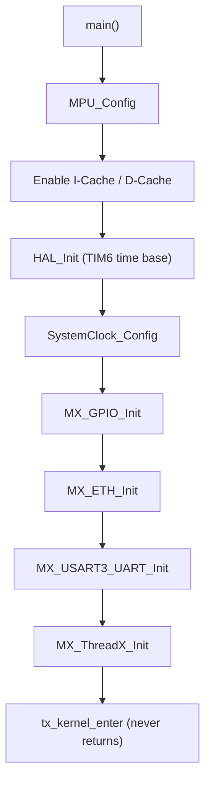
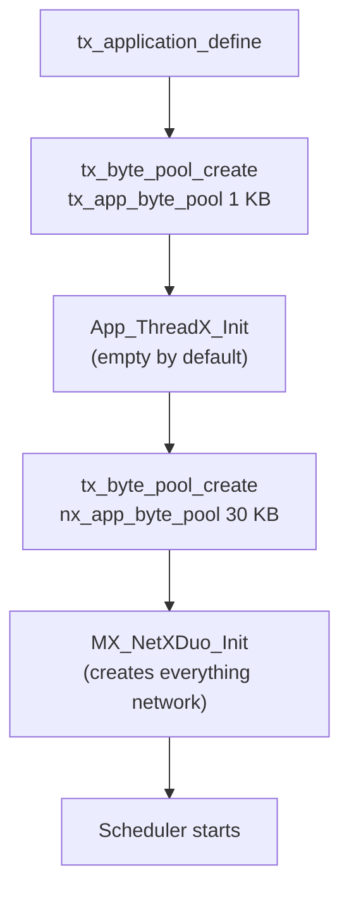
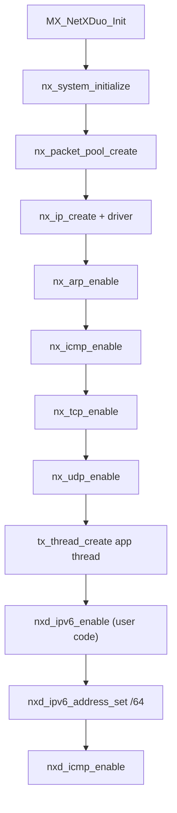
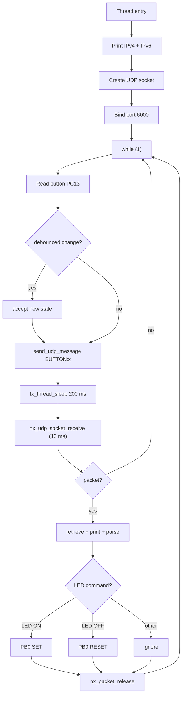

# Code walkthrough

An annotated tour of the important source files. Read this top to bottom; it
follows the exact order of execution. Line numbers refer to the current
revision.

---

## 1. `Core/Src/main.c` - hardware bring-up

`main()` is a conventional CubeMX main: MPU first, then caches, then HAL.

```c
int main(void)
{
  MPU_Config();              /* non-cacheable region for DMA descriptors */
  SCB_EnableICache();
  SCB_EnableDCache();
  HAL_Init();                /* TIM6 becomes the HAL time base */
  SystemClock_Config();      /* HSE bypass + PLL */
  MX_GPIO_Init();            /* LEDs PB0/PB7/PB14, button PC13 */
  MX_ETH_Init();             /* RMII MAC, MACAddr, DMA descriptors */
  MX_USART3_UART_Init();     /* 115200 8N1 console */
  MX_ThreadX_Init();         /* hands control to the RTOS, never returns */
  while (1) { }
}
```

Notable details:

* `DMARxDscrTab` / `DMATxDscrTab` are placed in the `.RxDecripSection` /
  `.TxDecripSection` sections, which the linker script puts into RAM_D2 at
  `0x30040000` and `0x30040060`.
* `MX_ETH_Init` sets `MACAddr` to `00:80:E1:00:00:00`, RMII mode, and a
  1536-byte RX buffer (`heth.Init.RxBuffLen`).
* `MX_ETH_Init` also configures TX checksum offload and CRC padding through
  `TxConfig`, which the `nx_stm32_eth_driver` uses for hardware-accelerated
  checksums.
* `__io_putchar` retargets `printf` to USART3, so every `printf` in the NetX
  layer lands on the Virtual COM port.
* `MPU_Config` region 1 covers `0x30040000` for 128 KB with
  `MPU_TEX_LEVEL1` and no cache, keeping DMA traffic coherent.
* `HAL_TIM_PeriodElapsedCallback` forwards TIM6 interrupts to `HAL_IncTick`.

### Execution flow



---

## 2. `Core/Src/app_threadx.c` - kernel entry

`MX_ThreadX_Init()` is a thin wrapper:

```c
void MX_ThreadX_Init(void)
{
  tx_kernel_enter();   /* ThreadX takes over; control returns only on error */
}
```

Before the scheduler runs, ThreadX calls the application-defined
`tx_application_define()`, implemented in `AZURE_RTOS/App/app_azure_rtos.c`.

---

## 3. `AZURE_RTOS/App/app_azure_rtos.c` - application bootstrap

```c
VOID tx_application_define(VOID *first_unused_memory)
{
  /* static allocation is enabled (USE_STATIC_ALLOCATION == 1) */
  tx_byte_pool_create(&tx_app_byte_pool, "Tx App memory pool",
                      tx_byte_pool_buffer, TX_APP_MEM_POOL_SIZE);
  App_ThreadX_Init((VOID *)&tx_app_byte_pool);

  tx_byte_pool_create(&nx_app_byte_pool, "Nx App memory pool",
                      nx_byte_pool_buffer, NX_APP_MEM_POOL_SIZE);
  MX_NetXDuo_Init((VOID *)&nx_app_byte_pool);
}
```

Ordering matters: the NetX byte pool must exist before `MX_NetXDuo_Init`
allocates the packet pool, IP stacks, and ARP cache from it.



---

## 4. `NetXDuo/App/app_netxduo.c` - network initialization

`MX_NetXDuo_Init` performs, in order:

1. `nx_system_initialize()`: NetX Duo global init.
2. `tx_byte_allocate` for the packet pool, then `nx_packet_pool_create`
   (1536-byte payload, 10 packets).
3. `tx_byte_allocate` 2 KB for the IP helper thread, then `nx_ip_create`
   with IP `192.168.1.111`, mask `255.255.255.0`, and the STM32 Ethernet
   driver.
4. ARP cache allocation + `nx_arp_enable`.
5. `nx_icmp_enable`, `nx_tcp_enable`, `nx_udp_enable`.
6. `tx_byte_allocate` 2 KB for the application thread, then
   `tx_thread_create` running `nx_app_thread_entry` at priority 10.
7. Inside the `USER CODE` block: `nxd_ipv6_enable`, then
   `nxd_ipv6_address_set` with `2600:1702:4eb2:9780::abcd` prefix `/64`,
   then `nxd_icmp_enable`.



---

## 5. `NetXDuo/App/app_netxduo.c` - the application thread

`nx_app_thread_entry` is the heart of the example. Pseudocode:

```c
static VOID nx_app_thread_entry(ULONG thread_input)
{
  /* 1. Print IPv4 and IPv6 addresses */
  nx_ip_address_get(&NetXDuoEthIpInstance, &IpAddress, &NetMask);
  PRINT_IP_ADDRESS(IpAddress);
  nxd_ipv6_address_get(&NetXDuoEthIpInstance, 0, ...);
  printIPv6(device_address);

  /* 2. Create and bind the UDP server socket on port 6000 */
  nx_udp_socket_create(&NetXDuoEthIpInstance, &UDPSocket, "UDP Server Socket",
                       NX_IP_NORMAL, NX_FRAGMENT_OKAY, NX_IP_TIME_TO_LIVE, 512);
  nx_udp_socket_bind(&UDPSocket, 6000, TX_WAIT_FOREVER);

  /* 3. Local state: debounce counter, LED state */
  uint8_t last_button_state = 1;      /* released */
  uint8_t stable_count = 0;
  const uint8_t STABLE_THRESHOLD = 2;

  while (1)
  {
    /* 4. Read B1, debounce, send BUTTON:x to 192.168.1.160:55100 */
    uint8_t current = HAL_GPIO_ReadPin(GPIOC, GPIO_PIN_13);
    ... debounce ...
    snprintf(msg_buffer, sizeof(msg_buffer), "BUTTON:%d", ...);
    send_udp_message(&remote_addr, 55100, msg_buffer);
    tx_thread_sleep(SEND_SLEEP_TICKS);            /* ~200 ms */

    /* 5. Non-blocking receive with 10 ms timeout */
    ret = nx_udp_socket_receive(&UDPSocket, &data_packet, 1);
    if (ret == NX_SUCCESS)
    {
      nx_packet_data_retrieve(data_packet, data_buffer, &bytes_read);
      ... print, strip CR/LF, parse LED commands ...
      nx_packet_release(data_packet);
    }
  }
}
```

### The main loop flowchart



### `send_udp_message` helper

```c
void send_udp_message(NXD_ADDRESS *destination, UINT port, char *message)
{
  NX_PACKET *send_packet;
  ret = nx_packet_allocate(&NxAppPool, &send_packet, NX_UDP_PACKET, TX_NO_WAIT);
  ret = nx_packet_data_append(send_packet, message, strlen(message), &NxAppPool, TX_NO_WAIT);
  ret = nxd_udp_socket_send(&UDPSocket, send_packet, destination, port);
  printf("Sent: %s\r\n", message);
}
```

Note the packet is released on allocation/append/send failure; on success NetX
Duo owns it after `nxd_udp_socket_send`.

---

## 6. `NetXDuo/App/nx_user.h` - NetX Duo build options

User-configurable build switches for the NetX Duo library. The ones that
matter for this example:

* `NX_MAX_PHYSICAL_INTERFACES 1`: one Ethernet interface.
* `NX_DRIVER_DEFERRED_PROCESSING`: packets are processed by the IP helper
  thread instead of the ISR.
* IPv6 is enabled (around lines 400 to 460): `FEATURE_NX_IPV6`,
  `NX_IPV6_NEIGHBOR_CACHE_SIZE 16`, destination/prefix/router tables of 8,
  and `NX_ENABLE_IPV6_ADDRESS_CHANGE_NOTIFY`.
* `NX_DISABLE_IPV6_DAD` disables duplicate address detection for faster
  link-up on constrained networks.
* `NX_IP_PERIODIC_RATE` maps to `TX_TIMER_TICKS_PER_SECOND` (default 100).

If you rebuild the NetX Duo library manually, keep `NX_INCLUDE_USER_DEFINE_FILE`
defined so this file is picked up.

---

## 7. `AZURE_RTOS/App/app_azure_rtos_config.h`

Two numbers control the whole memory footprint:

| Macro | Value | Consumed by |
|:------|:------|:------------|
| `TX_APP_MEM_POOL_SIZE` | 1024 | `App_ThreadX_Init` (unused so far) |
| `NX_APP_MEM_POOL_SIZE` | 30 KB | packet pool + 2 KB IP stack + 2 KB app stack + 1 KB ARP |

Increase `NX_APP_MEM_POOL_SIZE` if you enlarge the packet pool or stacks; the
pool lives in the `.NetXPoolSection` in RAM_D2 (see
[ARCHITECTURE.md](ARCHITECTURE.md), section 5).
