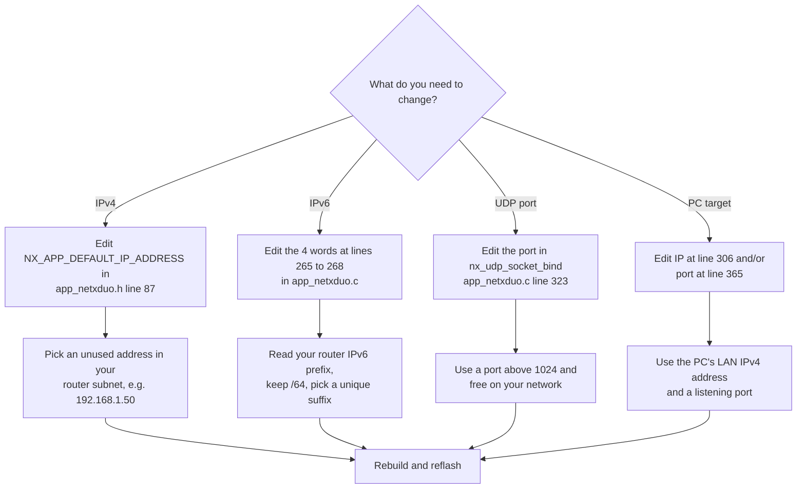
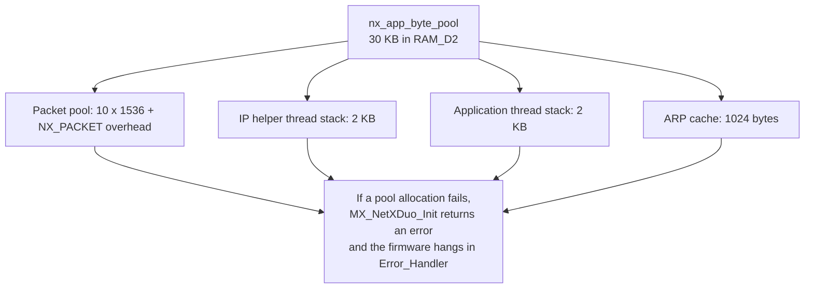

# Configuration reference

Every user-serviceable setting in this firmware, with the exact file and line
reference. Line numbers refer to the current revision of the repository.

---

## 1. Network addresses and ports

| Setting | Default | File / line | Notes |
|:--------|:--------|:------------|:------|
| IPv4 address | `192.168.1.111` | `NetXDuo/App/app_netxduo.h`, line 87 | Must be a free address in your LAN subnet |
| IPv4 netmask | `255.255.255.0` | `NetXDuo/App/app_netxduo.h`, line 89 | Change if your router uses a different mask |
| IPv6 global address | `2600:1702:4eb2:9780::abcd/64` | `NetXDuo/App/app_netxduo.c`, lines 265 to 268 | Hard-coded to the original developer's router subnet; edit for your network |
| IPv6 prefix length | `64` | `NetXDuo/App/app_netxduo.c`, line 270 | Passed to `nxd_ipv6_address_set` |
| UDP listen port | `6000` | `NetXDuo/App/app_netxduo.c`, line 323 | Second argument of `nx_udp_socket_bind` |
| Remote (PC) IP for button reports | `192.168.1.160` | `NetXDuo/App/app_netxduo.c`, line 306 | IPv4 address of the PC running the UDP listener |
| Remote (PC) port | `55100` | `NetXDuo/App/app_netxduo.c`, line 365 | The PC must listen on this UDP port |
| MAC address | `00:80:E1:00:00:00` | `Core/Src/main.c`, lines 229 to 234 | Bytes of `MACAddr[]` |

### Decision flow for changing addresses

---

## 2. Memory pool sizes

Defined in `AZURE_RTOS/App/app_azure_rtos_config.h` unless noted.

| Setting | Default | File / line | Notes |
|:--------|:--------|:------------|:------|
| `USE_STATIC_ALLOCATION` | `1` | `app_azure_rtos_config.h`, line 44 | Static byte pools instead of linker heap |
| `TX_APP_MEM_POOL_SIZE` | `1024` bytes | `app_azure_rtos_config.h`, line 46 | ThreadX application pool; only `App_ThreadX_Init` allocates from it |
| `NX_APP_MEM_POOL_SIZE` | `30 * 1024` bytes | `app_azure_rtos_config.h`, line 48 | NetX pool; must cover packet pool + stacks + ARP cache |
| `DEFAULT_PAYLOAD_SIZE` | `1536` bytes | `app_netxduo.h`, lines 48 to 49 | Must match `RxBuffLen` in `MX_ETH_Init` (`main.c`, line 239) |
| `DEFAULT_ARP_CACHE_SIZE` | `1024` bytes | `app_netxduo.h`, lines 52 to 53 | ARP cache memory passed to `nx_arp_enable` |
| `NX_APP_PACKET_POOL_SIZE` | `(1536 + sizeof(NX_PACKET)) * 10` | `app_netxduo.h`, line 75 | 10 packets in the pool |

---

## 3. Threads and timing

| Setting | Default | File / line | Notes |
|:--------|:--------|:------------|:------|
| `NX_APP_THREAD_STACK_SIZE` | `2 * 1024` | `app_netxduo.h`, line 77 | Application thread stack in bytes |
| `Nx_IP_INSTANCE_THREAD_SIZE` | `2 * 1024` | `app_netxduo.h`, line 79 | IP helper thread stack in bytes |
| `NX_APP_THREAD_PRIORITY` | `10` | `app_netxduo.h`, line 81 | Priority for both threads |
| `NX_APP_INSTANCE_PRIORITY` | same as thread priority | `app_netxduo.h`, line 84 | IP helper priority |
| `NX_APP_DEFAULT_TIMEOUT` | `10 * NX_IP_PERIODIC_RATE` | `app_netxduo.h`, line 73 | 1 second in ticks (unused by current code, kept for reference) |
| `SEND_SLEEP_TICKS` | `NX_IP_PERIODIC_RATE / 5` = 20 ticks | `app_netxduo.c`, line 331 | ~200 ms between button reports |
| UDP receive timeout | `1` tick | `app_netxduo.c`, line 373 | 10 ms poll timeout |
| `STABLE_THRESHOLD` | `2` | `app_netxduo.c`, line 330 | Consecutive identical reads required to accept a button change |

Timing math: `NX_IP_PERIODIC_RATE` is `TX_TIMER_TICKS_PER_SECOND`, which is not
overridden in `Core/Inc/tx_user.h` and therefore defaults to 100 ticks per
second. One tick is 10 ms.

---

## 4. Peripheral configuration (from the `.ioc`)

| Setting | Value | Where |
|:--------|:------|:------|
| MCU | STM32H743ZIT6, LQFP144 | `.ioc` `Mcu.Name` |
| Board | NUCLEO-H743ZI2 | `.ioc` |
| HSE | Bypass (external clock source) | `main.c`, `SystemClock_Config` |
| PLL | M=1, N=100, P=2, Q=2, R=2 | `main.c`, lines 179 to 183 |
| I-Cache / D-Cache | enabled | `main.c`, `main()` |
| MPU region 0 | 4 GB background, no access | `main.c`, `MPU_Config()` |
| MPU region 1 | 0x30040000, 128 KB, TEX level 1, full access, non-cacheable | `main.c`, lines 392 to 400 |
| ETH mode | RMII, `RxBuffLen = 1536` | `main.c`, `MX_ETH_Init` |
| ETH TX features | checksum offload + CRC pad | `main.c`, `MX_ETH_Init` |
| USART3 | 115200, 8N1, no flow control | `main.c`, `MX_USART3_UART_Init` |
| HAL time base | TIM6 | `.ioc` `VP_SYS_VS_tim6` |

---

## 5. LED command grammar

The parser in `nx_app_thread_entry` accepts (case-insensitive via substring
search, exact matches for bare tokens):

| Command (any casing) | Result |
|:---------------------|:-------|
| `LED ON`, `LED_ON`, `LEDON`, or any payload containing `LED` and `ON` | LD1 on |
| `LED OFF`, `LED_OFF`, `LEDOFF`, or any payload containing `LED` and `OFF` | LD1 off |
| `ON` (exact, upper or lower) | LD1 on |
| `OFF` (exact, upper or lower) | LD1 off |
| anything else | payload echoed to console only |

Command parsing flow: see [PROTOCOL.md](PROTOCOL.md), section 3.

---

## 6. Serial console

| Setting | Value |
|:--------|:------|
| Peripheral | USART3 (PD8 TX, PD9 RX) |
| Interface | ST-Link Virtual COM Port |
| Baud rate | 115200 |
| Data / parity / stop | 8 / none / 1 |

Output messages produced by the firmware:

| Message | When |
|:--------|:-----|
| `Device IPv4 Address: 192.168.1.111` | once at thread start |
| `Device IPv6 Address: 2600:1702:4eb2:9780:0:0:0:abcd` | once at thread start |
| `UDP Server listening on PORT 6000..` | after socket bind |
| `Sent: BUTTON:0` / `Sent: BUTTON:1` | each button report |
| raw payload + newline | each received UDP packet |
| `LED turned ON by command` / `LED turned OFF by command` | on recognized LED commands |
| `LED command not recognized: <payload>` | LED keyword without ON/OFF |
| `LED ON command received` / `LED OFF command received` | on bare `ON` / `OFF` |
