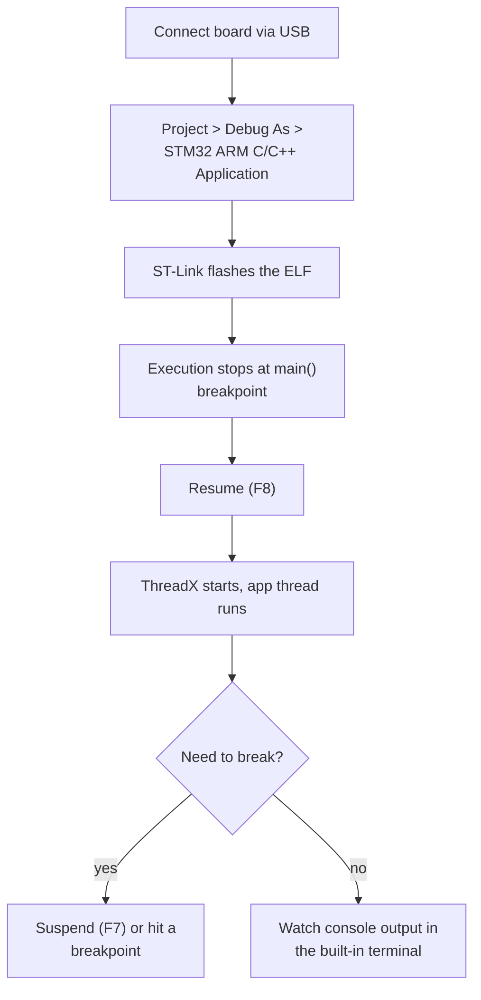
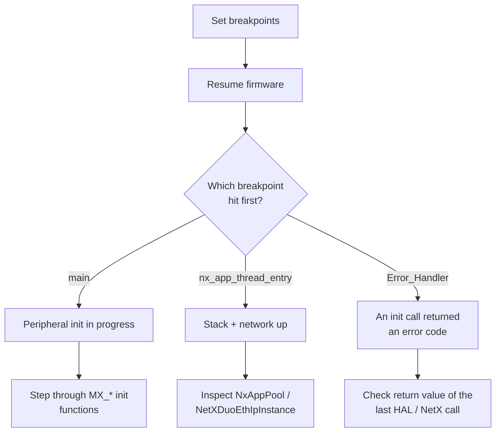
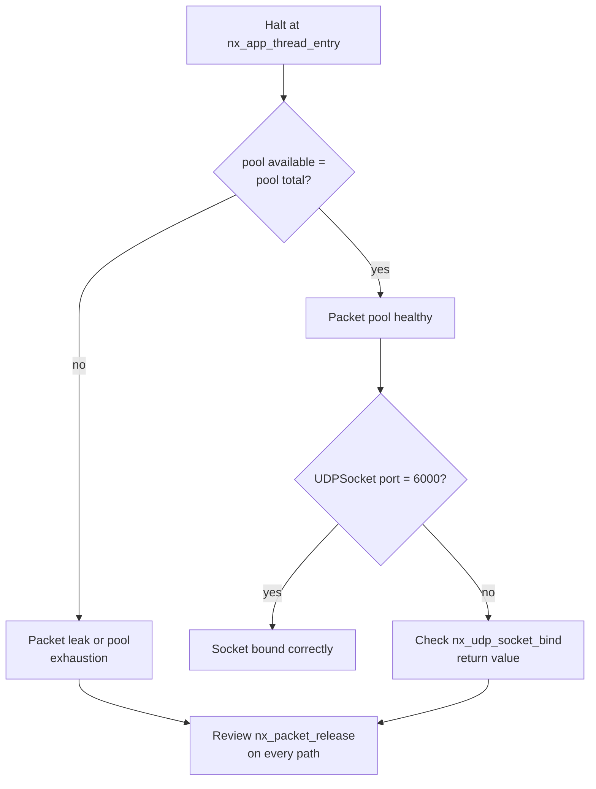
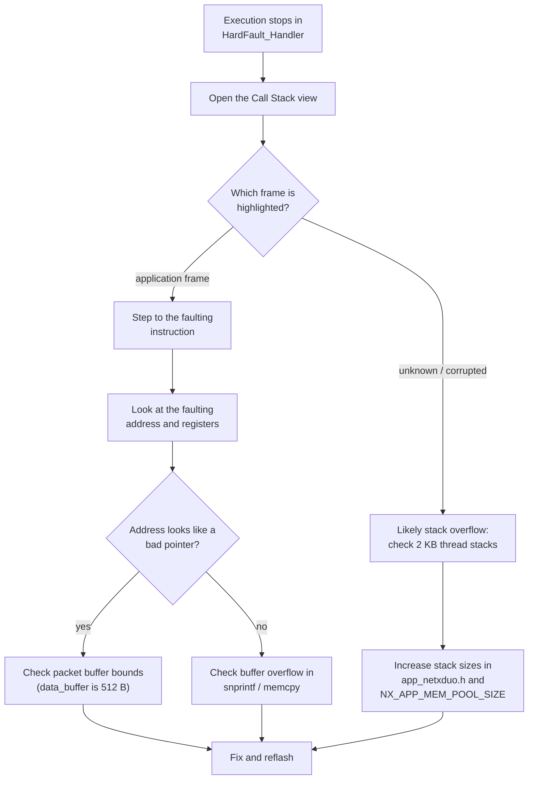
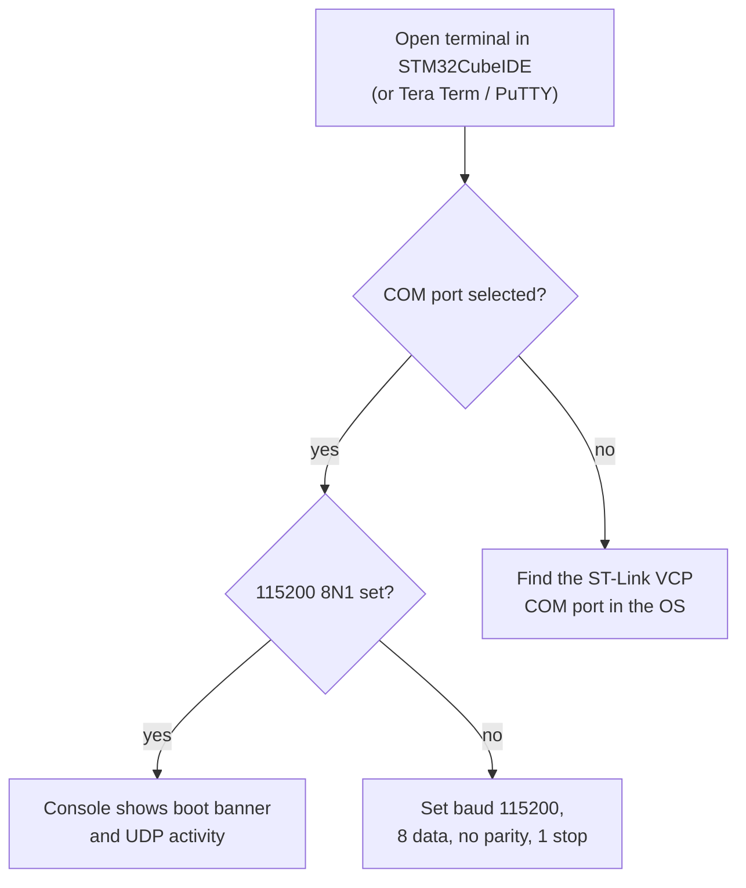
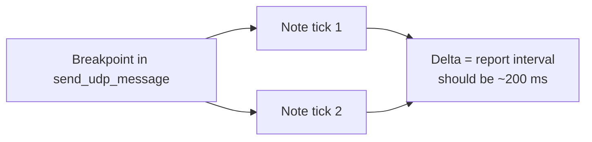

# Debugging

Practical debugging workflows for this firmware with STM32CubeIDE and the
on-board ST-Link: running the debugger, using breakpoints and watches,
analyzing a hard fault, and inspecting the network state.

---

## 1. Debug session basics

Tip: while suspended in the debugger, the target is halted and Ethernet RX
stops. Long suspensions can make the PC-side tools time out; keep sessions
short or disable the `main` breakpoint after first entry.

---

## 2. Useful breakpoints

| Breakpoint | File / function | What you learn |
|:-----------|:----------------|:---------------|
| `main()` | `Core/Src/main.c` | firmware entered |
| `nx_app_thread_entry` | `NetXDuo/App/app_netxduo.c` | app thread started |
| `send_udp_message` | `NetXDuo/App/app_netxduo.c` | button report path |
| `nx_udp_socket_receive` return | `NetXDuo/App/app_netxduo.c` line 373 | inbound packet handling |
| `Error_Handler()` | `Core/Src/main.c` | any init failure |
| `HAL_TIM_PeriodElapsedCallback` | `Core/Src/main.c` | HAL time base tick |

---

## 3. Watching the network state

While halted, use the Variables or Expressions view to inspect:

| Expression | Type | Meaning |
|:-----------|:-----|:--------|
| `NetXDuoEthIpInstance.nx_ip_interface[0].nx_interface_ip_address` | ULONG | IPv4 in network order |
| `NetXDuoEthIpInstance.nx_ip_interface[0].nx_interface_ip_network_mask` | ULONG | netmask |
| `NetXDuoEthIpInstance.nx_ip_interface[0].nx_interface_ipv6_address[0].nxd_ipv6_address` | NXD_ADDRESS | configured IPv6 |
| `NxAppPool.nx_packet_pool_available` | ULONG | free packets |
| `NxAppPool.nx_packet_pool_total` | ULONG | pool size |
| `UDPSocket.nx_udp_socket_port` | UINT | bound port (6000) |
| `UDPSocket.nx_udp_socket_receive_count` | ULONG | received datagrams |

---

## 4. Hard fault analysis

When the firmware crashes (e.g. stack overflow, null pointer), the debugger
stops in `HardFault_Handler`. Recovery steps:

Common hard fault sources in this code:

* `data_buffer[512]` overflow if a received datagram is larger than 512 bytes;
  the code clamps `bytes_read` to the buffer, but keep sends below 512 bytes.
* Stack overflow: both threads use 2 KB; `printf` uses the retargeted UART and
  can consume stack.
* Dereferencing a null `NX_PACKET *` when `nx_udp_socket_receive` failed.

---

## 5. Serial and SWV output

The debug console is the ST-Link Virtual COM port:

Note: on the H7 with ST-Link, SWO/ITM trace support is limited; the Virtual
COM port is the primary debug output, and `printf` retargets to USART3.

---

## 6. Measuring timing

| Goal | Method |
|:-----|:-------|
| Button report cadence | set a breakpoint in `send_udp_message`, read the elapsed time between hits |
| Receive latency | breakpoints on packet receive, compare timestamps in the console |
| Pool pressure | watch `NxAppPool.nx_packet_pool_available` while sending traffic |

Related: [TROUBLESHOOTING.md](TROUBLESHOOTING.md) for behavior fixes,
[TESTING.md](TESTING.md) for the functional test matrix.
