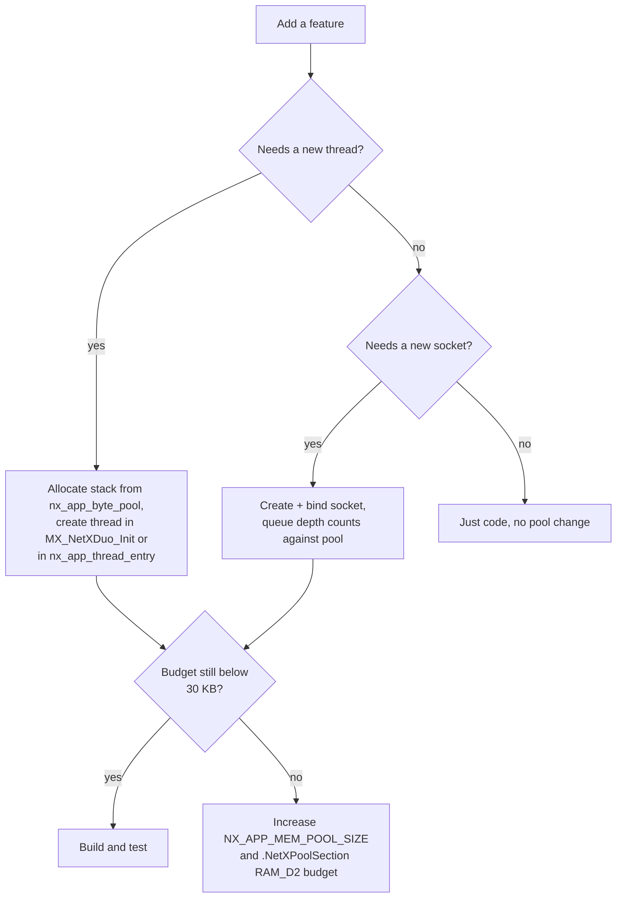
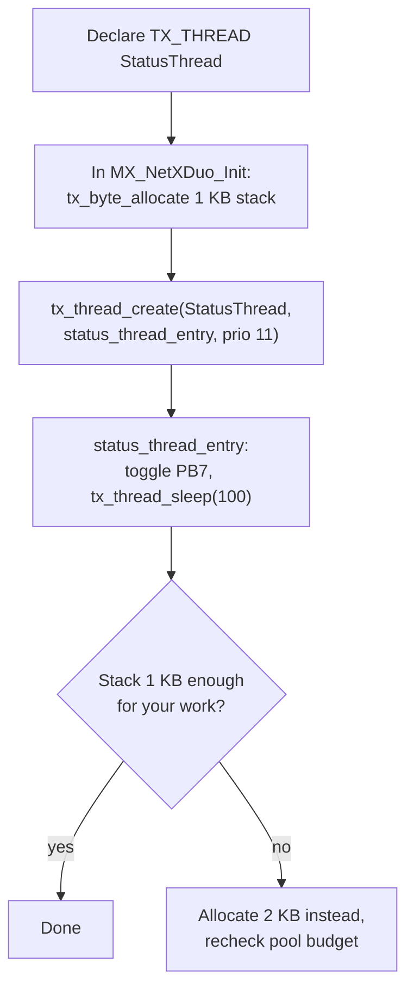
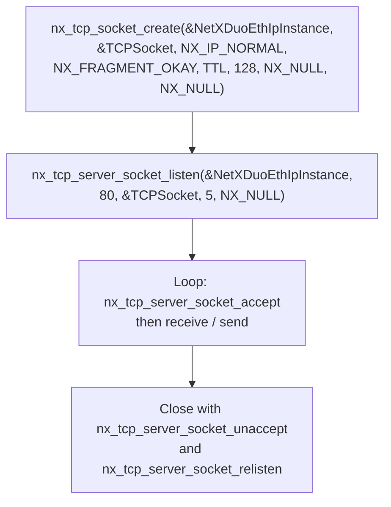
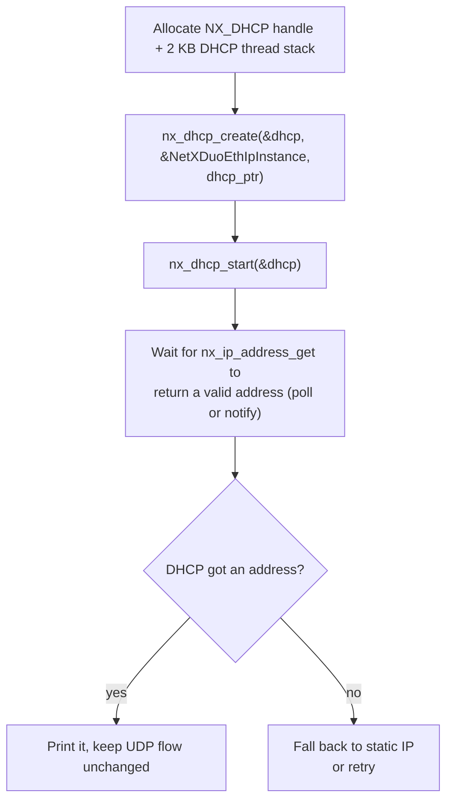
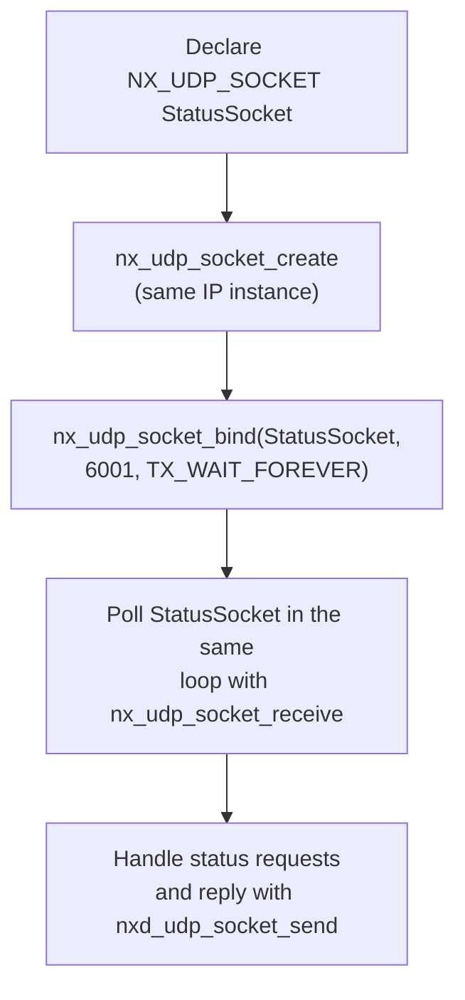

# Extending the firmware

This project is a compact base for a networked STM32 application. This
document shows how to add common features safely: a second thread, a TCP
server, DHCP, multiple UDP sockets, and IPv6 link-local testing, with the
exact memory and API implications.

---

## 1. General extension rules

Every new feature consumes memory from the 30 KB NetX byte pool (or the 1 KB
ThreadX pool), so plan the budget first.

---

## 2. Adding a second thread

Example: a periodic status thread that blinks LD2 (PB7) every second.

Checklist for the new thread:

* Use a distinct priority, or the same priority with time slicing.
* Allocate its stack from the byte pool **before** `tx_kernel_enter` returns,
  ideally in `MX_NetXDuo_Init`.
* Never call HAL blocking functions with long timeouts from a high priority
  thread without yielding.

---

## 3. Adding a TCP server

NetX Duo TCP is already enabled (`nx_tcp_enable`). To listen on port 80:

Watch out:

* TCP needs receive window and socket memory from the packet pool; each
  connection can hold multiple packets.
* This firmware currently enables TCP but only for the protocol engine, not
  for a listener; adding one is an application-layer change only.

---

## 4. Adding DHCP

Replace the static IPv4 assignment with DHCP:

Notes:

* Keep `NX_APP_DEFAULT_IP_ADDRESS` as a fallback, or remove it and use
  `IP_ADDRESS(0,0,0,0)` initially.
* Add `#include "nx_dhcp.h"`; the middleware is present in
  `Middlewares/ST/netxduo/common/inc/`.
* DHCP relies on UDP, already enabled.

---

## 5. Multiple UDP sockets or ports

The firmware uses one socket. To add a second service, for example a status
port:

Each socket queue (`queue_maximum`) can hold that many packets; budget them
against the packet pool. The single application thread can poll multiple
sockets sequentially with short timeouts.

---

## 6. IPv6 link-local testing without a router

If your network has no IPv6, you can still test IPv6 between the board and a
PC on the same switch using link-local addresses:

```mermaid
flowchart TD
    A["Keep the global address setup,<br/>or remove it"] --> B["Find the board link-local:<br/>console prints global only;<br/>read it in the debugger or<br/>use nxd_ipv6_address_get index 0"]
    B --> C["On the PC: ip -6 addr /<br/>ipconfig to find its link-local"]
    C --> D["Send UDP to the board link-local<br/>with a scope ID (e.g. fe80::...%eth0)"]
    D --> E{"Reply?"}
    E -->|"yes"| F["IPv6 path works on-link"]
    E -->|"no"| G["Check neighbor discovery<br/>and firewall"]
```

---

## 7. Feature roadmap ideas

| Feature | Effort | Main work |
|:--------|:-------|:----------|
| TCP echo server | low | socket + accept loop |
| DHCP | low | nx_dhcp_* calls + wait logic |
| DNS resolver | low | nx_dns_* with a resolver socket |
| Web dashboard | medium | TCP 80 + HTTP framing on top |
| MQTT client | high | requires TLS or plain TCP client |
| Multicast | low | `nx_igmp_enable` / MLD for IPv6 |
| Persistent config | medium | store IP settings in backup SRAM or flash |

Related: [API_REFERENCE.md](API_REFERENCE.md) for signatures,
[MEMORY_LAYOUT.md](MEMORY_LAYOUT.md) for the budget,
[TROUBLESHOOTING.md](TROUBLESHOOTING.md) when things do not work.
