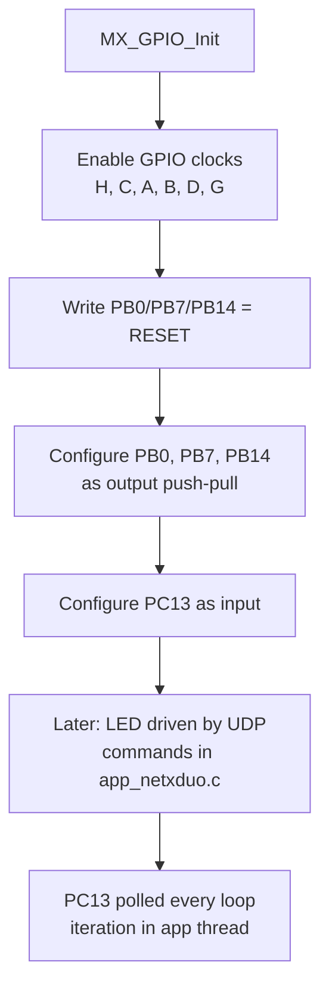
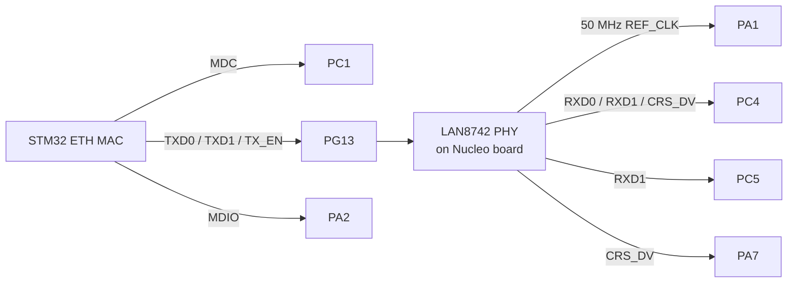
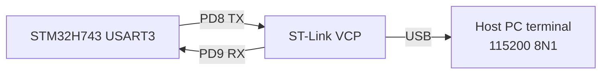
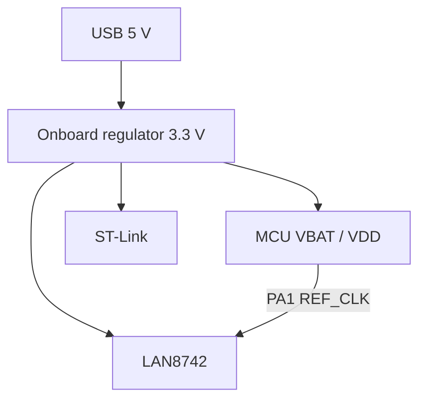

# GPIO and board reference

A complete reference for the NUCLEO-H743ZI2 board resources used by this
firmware: LEDs, user button, the Virtual COM port, and the Ethernet interface,
with the exact GPIO configuration.

---

## 1. Board features used

| Feature | Interface | Pin(s) | Purpose in this project |
|:--------|:----------|:-------|:------------------------|
| User LED LD1 (green) | GPIO output push-pull | PB0 | controlled by UDP commands |
| User LED LD2 (blue) | GPIO output push-pull | PB7 | initialized, unused |
| User LED LD3 (red) | GPIO output push-pull | PB14 | initialized, unused |
| User button B1 | GPIO input (no pull) | PC13 | polled for button reports |
| ST-Link Virtual COM | USART3 | PD8 TX, PD9 RX | serial console, 115200 8N1 |
| Ethernet | RMII + LAN8742 PHY | see table below | UDP over IPv4 and IPv6 |
| HSE clock | bypass input | PH0-OSC_IN | 8 MHz clock source |

---

## 2. LED and button configuration

From `MX_GPIO_Init()` in `Core/Src/main.c`:

| Pin | Mode | Pull | Speed | Initial level |
|:----|:-----|:-----|:------|:--------------|
| PB0 (LD1) | output push-pull | none | low | reset (off) |
| PB7 (LD2) | output push-pull | none | low | reset (off) |
| PB14 (LD3) | output push-pull | none | low | reset (off) |
| PC13 (B1) | input | none | - | - |

Electrical behavior of B1 on the Nucleo:

* The button connects PC13 to ground when pressed.
* With no pull resistor, the pin floats when released, so the firmware treats
  the read value as a state signal and debounces it:
  * `BUTTON:1` is reported when the read equals the released level (high).
  * `BUTTON:0` is reported when the read equals the pressed level (low).

---

## 3. RMII Ethernet pin map

The `.ioc` and `MX_ETH_Init` configure the Ethernet MAC in RMII mode. The
LAN8742 PHY on the Nucleo provides the 50 MHz RMII reference clock on PA1.

| STM32 pin | RMII signal | Direction |
|:----------|:------------|:----------|
| PA1 | RMII_REF_CLK (50 MHz, from PHY) | input |
| PA2 | RMII_MDIO | bidirectional |
| PA7 | RMII_CRS_DV | input |
| PC1 | RMII_MDC | output |
| PC4 | RMII_RXD0 | input |
| PC5 | RMII_RXD1 | input |
| PB13 | RMII_TXD1 | output |
| PG11 | RMII_TX_EN | output |
| PG13 | RMII_TXD0 | output |
| PH0 | HSE clock input | input |

The Ethernet DMA descriptors live at `0x30040000` (see
[MEMORY_LAYOUT.md](MEMORY_LAYOUT.md)), and `heth.Init.RxBuffLen` is 1536 bytes,
which must match `DEFAULT_PAYLOAD_SIZE` in `app_netxduo.h`.

---

## 4. Serial console wiring

USART3 is connected to the ST-Link on the Nucleo-144 board:

| STM32 pin | Signal | Goes to |
|:----------|:-------|:--------|
| PD8 | USART3_TX | ST-Link VCP RX |
| PD9 | USART3_RX | ST-Link VCP TX |

Baud generation: with the APB4 clock at 100 MHz and oversampling 16, 115200
baud is exact enough for the ST-Link bridge. See
[SYSTEM_CLOCK.md](SYSTEM_CLOCK.md) for the clock values.

---

## 5. Power and reset

| Item | Details |
|:-----|:--------|
| Power source | USB 5 V from the PC or a powered hub |
| Regulator | onboard 3.3 V LDO for the MCU and PHY |
| Reset | B2 button on the board (not used by firmware) |
| Boot mode | default flash boot (BOOT0 pulled low) |

---

## 6. Pin configuration reference

Full pin list from the `.ioc` file:

| Pin | Function |
|:----|:---------|
| PA1, PA2, PA7 | RMII: REF_CLK, MDIO, CRS_DV |
| PB0, PB7, PB14 | LD1, LD2, LD3 |
| PB13 | RMII TXD1 |
| PC1 | RMII MDC |
| PC4, PC5 | RMII RXD0, RXD1 |
| PC13 | B1 user button |
| PD8, PD9 | USART3 TX, RX |
| PG11, PG13 | RMII TX_EN, TXD0 |
| PH0 | HSE clock input |

Related: [SYSTEM_CLOCK.md](SYSTEM_CLOCK.md) for clocking,
[ARCHITECTURE.md](ARCHITECTURE.md) for the system diagram.
