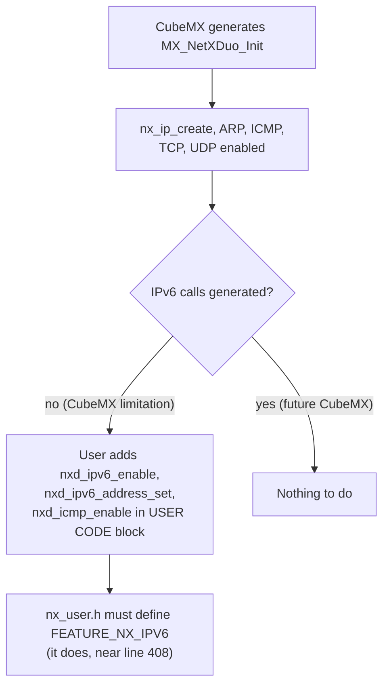
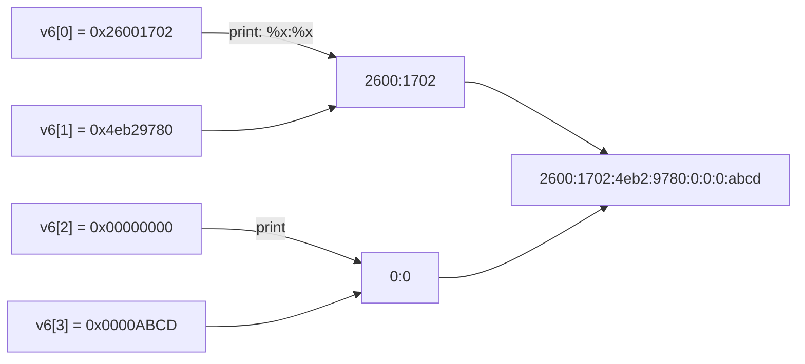
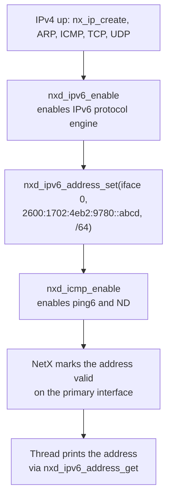
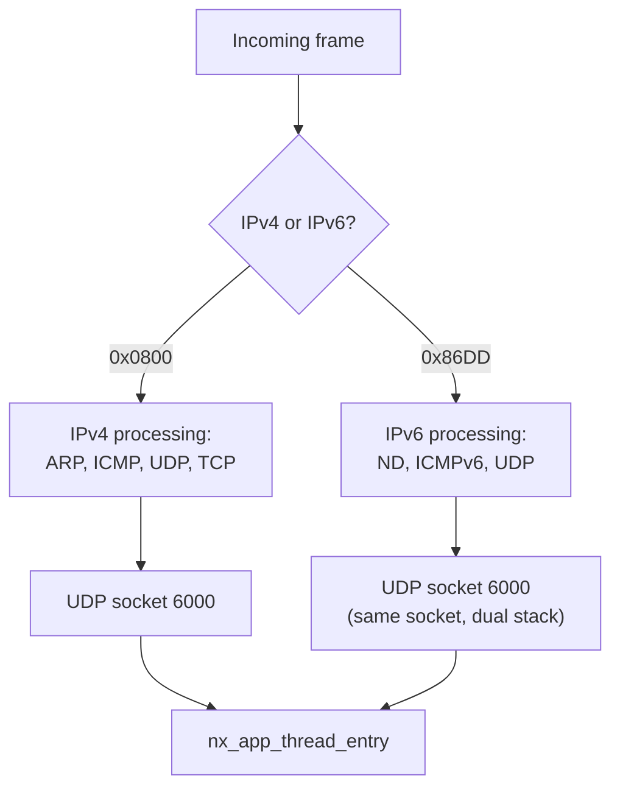
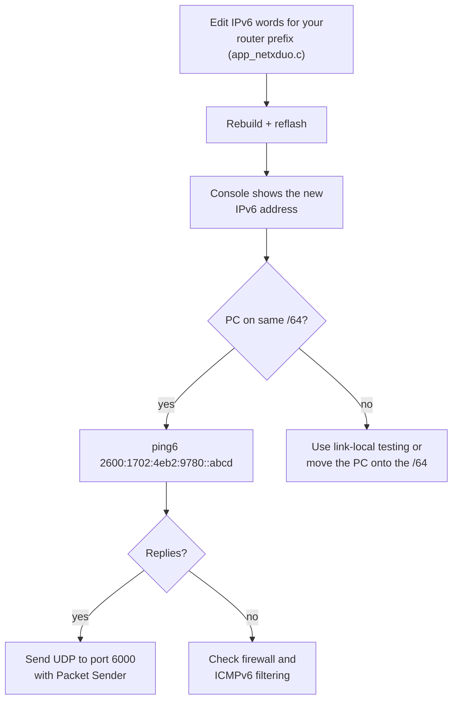
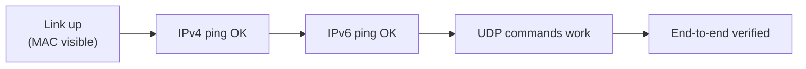

# IPv6 and networking deep dive

This project is one of the rare CubeMX examples that actually enables IPv6
(end-to-end, not just the CubeMX checkbox). This document explains the IPv6
configuration, how the address words map to a readable address, how IPv4 and
IPv6 coexist, and how to verify networking at each layer.

---

## 1. Why IPv6 is not generated by CubeMX

STM32CubeMX's Azure RTOS integration enables `nx_udp_enable`, `nx_arp_enable`,
and the IPv4 path automatically. IPv6 requires `nxd_ipv6_enable`,
`nxd_ipv6_address_set`, and `nxd_icmp_enable`, plus NetX Duo library options in
`nx_user.h`. CubeMX does not emit these calls, so they live in the
`USER CODE BEGIN MX_NetXDuo_Init` block of `app_netxduo.c`.



---

## 2. The IPv6 address configuration

From `app_netxduo.c`, lines 264 to 270:

```c
ipv6_address.nxd_ip_version = NX_IP_VERSION_V6;
ipv6_address.nxd_ip_address.v6[0] = 0x26001702;
ipv6_address.nxd_ip_address.v6[1] = 0x4eb29780;
ipv6_address.nxd_ip_address.v6[2] = 0x00000000;
ipv6_address.nxd_ip_address.v6[3] = 0x0000ABCD;
ret = nxd_ipv6_address_set(&NetXDuoEthIpInstance, 0, &ipv6_address, 64, NX_NULL);
```

The four 32-bit words `v6[0..3]` are the four groups of the address:

| Word | Hex | Readable address part |
|:-----|:----|:----------------------|
| `v6[0]` | `0x26001702` | `2600:1702` |
| `v6[1]` | `0x4eb29780` | `4eb2:9780` |
| `v6[2]` | `0x00000000` | `0:0` |
| `v6[3]` | `0x0000ABCD` | `0:abcd` |

Full address: `2600:1702:4eb2:9780::abcd` with prefix length 64 on
interface index 0 (the only interface, see `NX_MAX_PHYSICAL_INTERFACES 1` in
`nx_user.h`).



`printIPv6()` prints each word as two 16-bit halves, which is why the console
shows `2600:1702:4eb2:9780:0:0:0:abcd`.

---

## 3. IPv6 init sequence



Related options in `nx_user.h` that shape IPv6 behavior:

| Option | Value | Effect |
|:-------|:------|:-------|
| `NX_DISABLE_IPV6_DAD` | defined | duplicate address detection skipped; faster startup |
| `NX_IPV6_NEIGHBOR_CACHE_SIZE` | 16 | neighbor cache entries |
| `NX_IPV6_DESTINATION_TABLE_SIZE` | 8 | destination table entries |
| `NX_IPV6_PREFIX_LIST_TABLE_SIZE` | 8 | prefix list entries |
| `NX_IPV6_DEFAULT_ROUTER_TABLE_SIZE` | 8 | default router entries |
| `NX_MAX_MULTICAST_SOLICIT` / `NX_MAX_UNICAST_SOLICIT` | 3 | neighbor solicitation retries |

---

## 4. IPv4 and IPv6 coexistence

NetX Duo demultiplexes by version at the IP layer:



Both versions deliver to the same `UDPSocket`, which is why the same port 6000
works for `LED ON` over IPv4 and `LED OFF` over IPv6.

---

## 5. Link-local and global addresses

The firmware configures one **global** address. NetX Duo automatically creates
a **link-local** address (FE80::/10) from the MAC address on interface 0.

| Address type | Example | Scope |
|:-------------|:--------|:------|
| Link-local | `fe80::280:e1ff:fe00:0` (derived from MAC `00:80:E1:00:00:00`) | same link only |
| Global | `2600:1702:4eb2:9780::abcd` | routed across networks |

The console prints the global address (index 0 via `nxd_ipv6_address_get`).

---

## 6. Testing IPv6



Important: the example's hard-coded address belongs to the original
developer's subnet. On your router it must be replaced, otherwise packets to
the board's IPv6 address may be dropped by the router. See
[TROUBLESHOOTING.md](TROUBLESHOOTING.md) for the word-format recipe.

---

## 7. Verifying each network layer

| Layer | Test | Expect |
|:------|:-----|:-------|
| Link | router client list shows MAC `00:80:E1:00:00:00` | board present |
| IPv4 | `ping 192.168.1.111` | replies (ICMP enabled) |
| IPv6 | `ping6 2600:1702:4eb2:9780::abcd` | replies (ICMPv6 enabled) |
| UDP | Packet Sender `LED ON` to 6000 | LD1 on, console echo |



Related: [AZURE_RTOS_OVERVIEW.md](AZURE_RTOS_OVERVIEW.md) for the stack,
[PROTOCOL.md](PROTOCOL.md) for the UDP messages.
