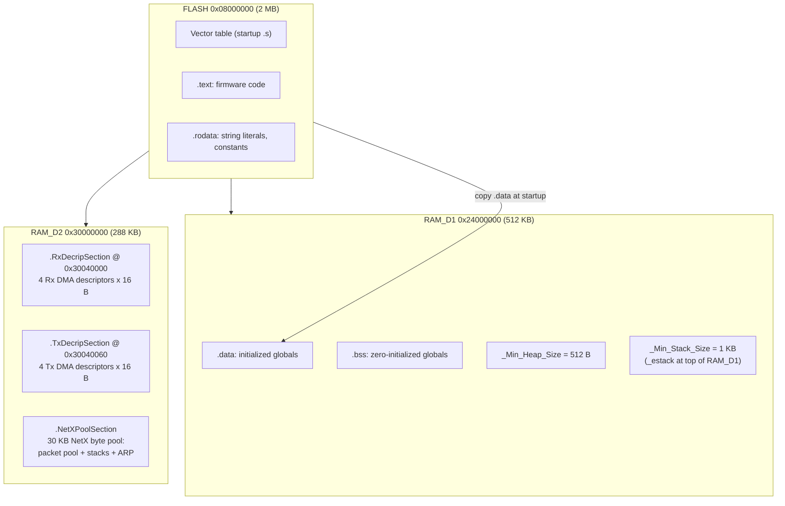
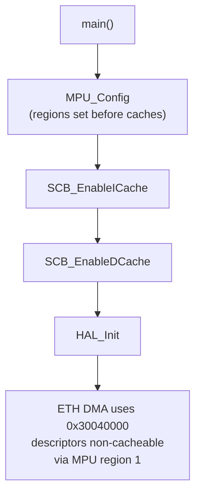
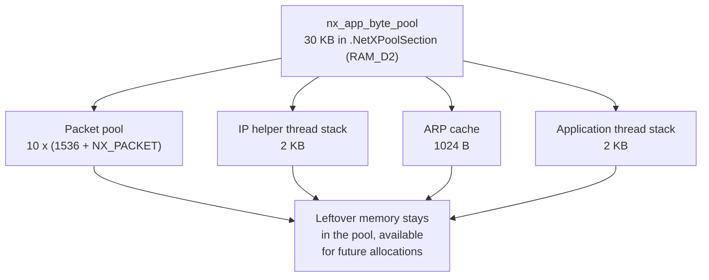
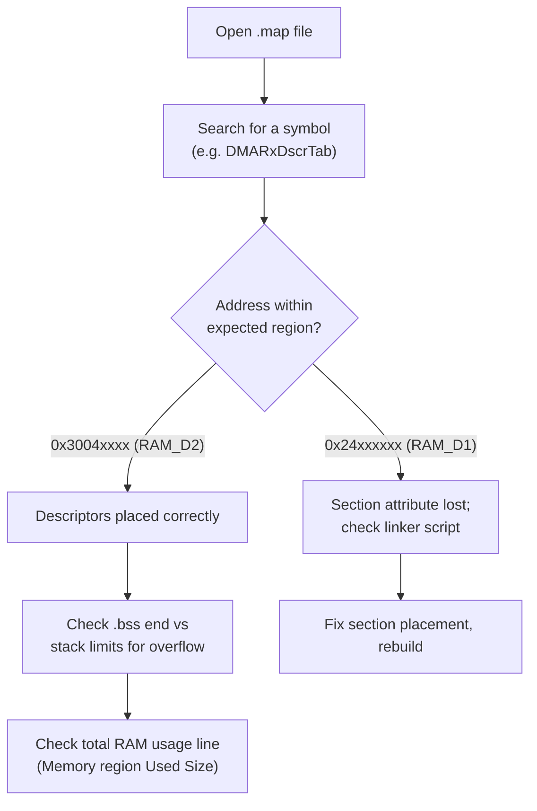

# Memory layout

This document explains where code and data live on the STM32H743ZIT6, what
the linker script `STM32H743ZITX_FLASH.ld` does, why the Ethernet descriptors
and the NetX packet pool are placed in RAM_D2, and how to read the memory map
file.

---

## 1. On-chip memory overview

The STM32H743 has several RAM regions with different cache and DMA
characteristics:

| Region | Address | Size | Characteristics |
|:-------|:--------|:-----|:----------------|
| FLASH | `0x08000000` | 2 MB | code and constants |
| ITCMRAM | `0x00000000` | 64 KB | tightly coupled, fastest for code |
| DTCMRAM | `0x20000000` | 128 KB | tightly coupled, fastest for data |
| RAM_D1 (AXI SRAM) | `0x24000000` | 512 KB | main RAM, cacheable, DMA capable |
| RAM_D2 (SRAM1+2+3) | `0x30000000` | 288 KB | DMA friendly, no D-Cache by default |
| RAM_D3 (backup SRAM) | `0x38000000` | 64 KB | retained across some low-power modes |

The linker script defines all of these in the `MEMORY` block:

```
MEMORY
{
  FLASH (rx)     : ORIGIN = 0x08000000, LENGTH = 2048K
  DTCMRAM (xrw)  : ORIGIN = 0x20000000, LENGTH = 128K
  RAM_D1 (xrw)   : ORIGIN = 0x24000000, LENGTH = 512K
  RAM_D2 (xrw)   : ORIGIN = 0x30000000, LENGTH = 288K
  RAM_D3 (xrw)   : ORIGIN = 0x38000000, LENGTH = 64K
  ITCMRAM (xrw)  : ORIGIN = 0x00000000, LENGTH = 64K
}
```

---

## 2. Region usage in this project



Why RAM_D2? Ethernet DMA writes received frames into the descriptor tables and
packet buffers. If those buffers lived in cacheable RAM_D1, the CPU could read
stale cached copies. Placing them in RAM_D2 (which is not covered by the
D-Cache setup in this project) keeps DMA and CPU views coherent, and the MPU
region reinforces the non-cacheable behavior for the descriptor area.

---

## 3. Special linker sections

From `STM32H743ZITX_FLASH.ld` (the `.data` output section):

```ld
. = ALIGN(8);
*(.RxDecripSection)
*(.TxDecripSection)
*(.NetXPoolSection)
. = ALIGN(8);
} >RAM_D2 AT> FLASH
```

| Section | Contents | Declared in |
|:--------|:---------|:------------|
| `.RxDecripSection` | `DMARxDscrTab[ETH_RX_DESC_CNT]` | `Core/Src/main.c`, lines 57 to 58 (GNU section attribute) |
| `.TxDecripSection` | `DMATxDscrTab[ETH_TX_DESC_CNT]` | `Core/Src/main.c`, lines 57 to 58 |
| `.NetXPoolSection` | `nx_byte_pool_buffer[NX_APP_MEM_POOL_SIZE]` | `AZURE_RTOS/App/app_azure_rtos.c`, GNU section attribute |

Descriptor details:

| Item | Value |
|:-----|:------|
| `ETH_RX_DESC_CNT` | 4 (`Core/Inc/stm32h7xx_hal_conf.h`, line 225) |
| `ETH_TX_DESC_CNT` | 4 (line 224) |
| `ETH_DMADescTypeDef` size | 16 bytes (4 x `DESC0..DESC3`) |
| Rx table size | 64 bytes at `0x30040000` |
| Tx table size | 64 bytes at `0x30040060` |
| NetX pool | 30 KB (`NX_APP_MEM_POOL_SIZE`) |

---

## 4. The MPU and cache

`MPU_Config()` in `Core/Src/main.c` configures two regions:

| Region | Base | Size | Attributes | Purpose |
|:-------|:-----|:-----|:-----------|:--------|
| 0 | `0x00000000` | 4 GB | no access, subregions disabled (0x87) | background region to catch illegal accesses |
| 1 | `0x30040000` | 128 KB | TEX level 1, full access, non-cacheable, non-bufferable | Ethernet descriptor area in RAM_D2 |

The instruction cache and data cache are enabled in `main()` before the HAL is
initialized, so the MPU must be set up first (it is, in `main()`).



Note: the 128 KB MPU region at `0x30040000` covers SRAM3 and beyond. It is
larger than strictly needed because the ST example reuses one region for the
whole descriptor neighborhood; keep it when editing the linker script.

---

## 5. Stacks and heaps

| Symbol | Value | File |
|:-------|:------|:-----|
| `_estack` | `ORIGIN(RAM_D1) + LENGTH(RAM_D1)` = `0x2407FFFF` top | linker script line 38 |
| `_Min_Heap_Size` | `0x200` = 512 bytes | line 40 |
| `_Min_Stack_Size` | `0x400` = 1 KB | line 41 |
| ThreadX/NetX application stacks | 2 KB each, allocated from the NetX byte pool | `app_netxduo.h` |

The 1 KB `_Min_Stack_Size` is the MSP stack for interrupts and pre-scheduler
code. ThreadX threads run on their own 2 KB stacks drawn from the 30 KB NetX
byte pool.

---

## 6. NetX byte pool allocation map

`MX_NetXDuo_Init` carves memory out of the 30 KB `nx_app_byte_pool`:



Rough accounting (packet pool is the big consumer):

```
packet pool: 10 x 1536 + 10 x sizeof(NX_PACKET)  ~ 16 KB
IP stack:    2 KB
ARP cache:   1 KB
app stack:   2 KB
total used:  ~ 21 KB of 30 KB
```

If you add sockets, threads, or larger buffers, keep the total below
`NX_APP_MEM_POOL_SIZE` or the firmware will hang in `Error_Handler()`.

---

## 7. Reading the map file

After a build, `Debug/NUCLEO_H743_NetXDuo_UDP_IPv4_IPv6.map` shows where every
symbol landed:

```bash
grep -n "RxDecripSection\|NetXPoolSection" Debug/*.map
grep -n "nx_byte_pool_buffer\|DMARxDscrTab" Debug/*.map
```



Related: [SYSTEM_CLOCK.md](SYSTEM_CLOCK.md) for the clock tree,
[GPIO_AND_BOARD.md](GPIO_AND_BOARD.md) for pins, and
[ARCHITECTURE.md](ARCHITECTURE.md) for the system overview.
