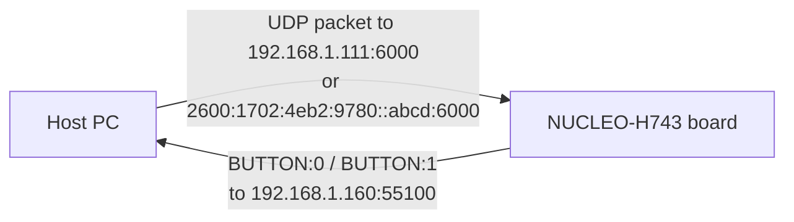
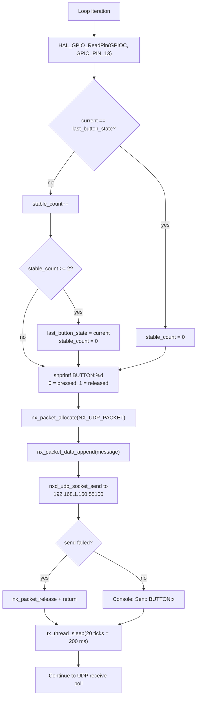
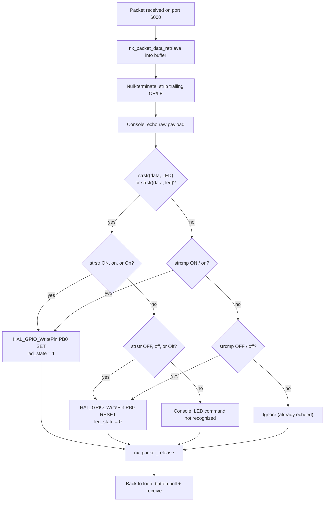
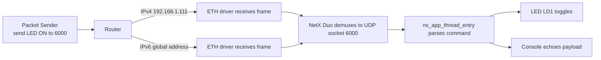
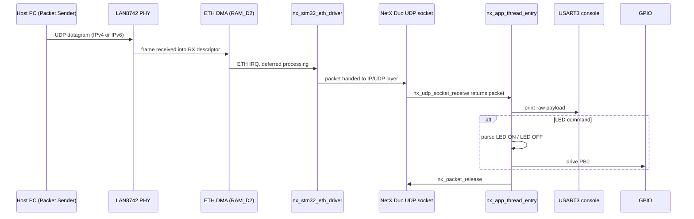

# UDP protocol reference

The board is a UDP endpoint on the local network. It exposes one server socket
(listening on both IPv4 and IPv6) and one client socket for button reports.

---

## 1. Port summary

| Socket | Role | Port | Payload direction |
|:-------|:-----|:-----|:------------------|
| `UDPSocket` | server, bound in `nx_app_thread_entry` | **6000** | PC to board (commands), board echoes to console |
| `UDPSocket` | client, used by `send_udp_message` | **55100** (destination) | board to PC (button state) |

Both roles share the single `UDPSocket` instance created at
`app_netxduo.c` line 318.



---

## 2. Outbound messages: button state

The application thread polls the user button B1 (PC13, active low) every loop
iteration and reports its state roughly every 200 ms.

| Payload | Meaning |
|:--------|:--------|
| `BUTTON:1` | button released (PC13 reads high) |
| `BUTTON:0` | button pressed (PC13 reads low) |

### Outbound flow



The `BUTTON:0` / `BUTTON:1` framing is plain ASCII text with no terminator;
receivers may treat the whole datagram as the message. A netcat listener:

```bash
nc -u -l 55100
```

Or in Packet Sender: switch to **Server** mode, bind UDP port 55100, and watch
the incoming pane.

---

## 3. Inbound messages: LED commands

Every received datagram on port 6000 is printed to the serial console. Then the
parser tries to classify it:

| Payload pattern | LED LD1 (PB0) |
|:----------------|:--------------|
| contains `LED` (any case) and contains `ON`, `on`, or `On` | SET (on) |
| contains `LED` (any case) and contains `OFF`, `off`, or `Off` (but no ON variant) | RESET (off) |
| contains `LED` but neither ON nor OFF variant | unchanged, console message |
| exactly `ON` or `on` | SET (on) |
| exactly `OFF` or `off` | RESET (off) |
| anything else | unchanged, payload echoed to console |

### Inbound decision flowchart



Examples that work:

```
LED ON
led on
LED_ON
LEDON
ON
on

LED OFF
led off
LED_OFF
LEDOFF
OFF
off
```

The parser is intentionally lenient (substring matching). `LED ON` and
`LED_ON` and `LEDON` all contain the substrings `LED` and `ON`, so all of them
work. Note that `LED_OFF` contains `OFF` but not `ON`, so it correctly turns
the LED off.

---

## 4. Packet Sender quick setup

| Field | IPv4 test | IPv6 test |
|:------|:----------|:----------|
| Protocol | UDP | UDP |
| IP / Hostname | `192.168.1.111` | `2600:1702:4eb2:9780::abcd` |
| Port | `6000` | `6000` |
| Payload | `LED ON` | `LED OFF` |

Screenshots in the README (`images/ipv4_packetsender.jpg` and
`images/ipv6_packetsender.jpg`) show both cases.



---

## 5. End-to-end data flow for a received packet


