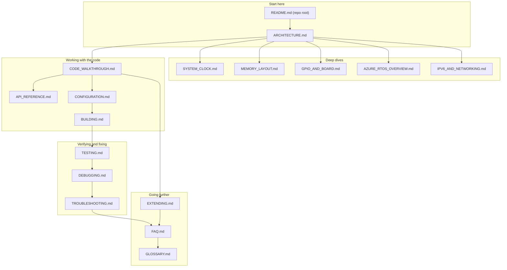

# Documentation index

All documentation for the Dual IPv4 and IPv6 UDP with NetX Duo on NUCLEO-H743
project. Every guide uses Mermaid flowcharts that render on GitHub.

## Full list of guides

| Guide | Purpose |
|:------|:--------|
| [ARCHITECTURE.md](ARCHITECTURE.md) | System diagram, software stack, boot flow, thread model, memory map, interrupts |
| [SYSTEM_CLOCK.md](SYSTEM_CLOCK.md) | Clock source, PLL math, bus dividers, HAL time base |
| [MEMORY_LAYOUT.md](MEMORY_LAYOUT.md) | Linker script, RAM regions, special sections, MPU, reading the map file |
| [GPIO_AND_BOARD.md](GPIO_AND_BOARD.md) | Board features, LED/button config, RMII pin map, serial console wiring |
| [AZURE_RTOS_OVERVIEW.md](AZURE_RTOS_OVERVIEW.md) | ThreadX and NetX Duo concepts used by this firmware |
| [IPV6_AND_NETWORKING.md](IPV6_AND_NETWORKING.md) | IPv6 configuration, address words, dual-stack demux, testing |
| [BUILDING.md](BUILDING.md) | Import into STM32CubeIDE, build, flash, debug, CLI build, CubeMX regeneration |
| [CONFIGURATION.md](CONFIGURATION.md) | Every configurable parameter with exact file and line references |
| [PROTOCOL.md](PROTOCOL.md) | UDP ports, message grammar, decision flowcharts, Packet Sender setup |
| [CODE_WALKTHROUGH.md](CODE_WALKTHROUGH.md) | Annotated tour of main.c, app_azure_rtos.c, app_netxduo.c |
| [API_REFERENCE.md](API_REFERENCE.md) | Every application and middleware function signature used |
| [TESTING.md](TESTING.md) | Repeatable test matrix with expected results |
| [DEBUGGING.md](DEBUGGING.md) | Breakpoints, watch expressions, hard fault analysis, timing |
| [TROUBLESHOOTING.md](TROUBLESHOOTING.md) | Common problems, root causes, and fixes |
| [EXTENDING.md](EXTENDING.md) | Add threads, TCP, DHCP, more sockets, link-local testing |
| [FAQ.md](FAQ.md) | Frequently asked questions with short answers |
| [GLOSSARY.md](GLOSSARY.md) | Terms used throughout the repository |

## How the guides fit together

## Suggested reading order

1. Root README for the one-screen overview.
2. ARCHITECTURE for the big picture.
3. SYSTEM_CLOCK, MEMORY_LAYOUT, GPIO_AND_BOARD for platform details.
4. AZURE_RTOS_OVERVIEW and IPV6_AND_NETWORKING for the stack.
5. CODE_WALKTHROUGH and API_REFERENCE before changing code.
6. CONFIGURATION and BUILDING before flashing your own settings.
7. TESTING, DEBUGGING, TROUBLESHOOTING when verifying or fixing.
8. EXTENDING and FAQ when you outgrow the example.
