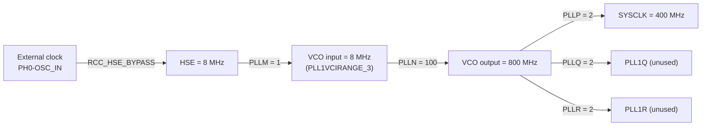
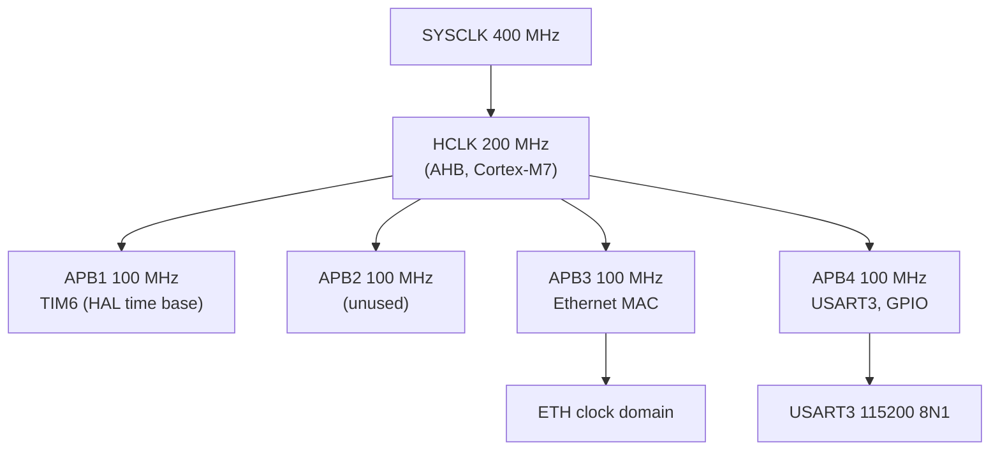
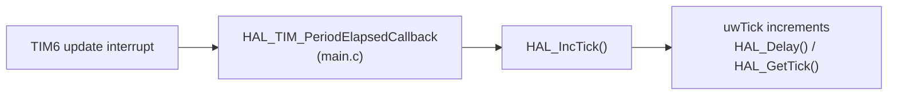
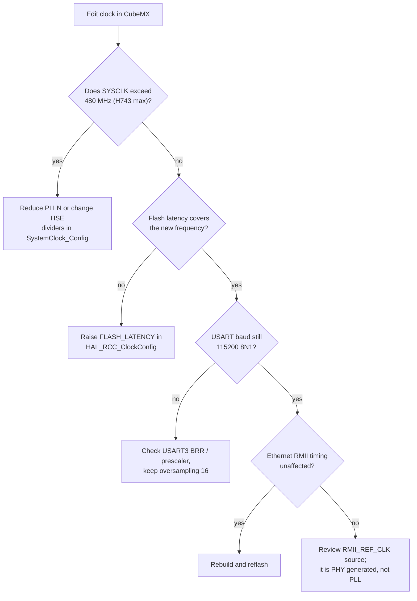

# System clock tree

This document explains how the STM32H743ZIT6 is clocked in this project: the
oscillator source, the PLL configuration, the bus dividers, and how the clock
settings affect Ethernet and the serial console.

---

## 1. Clock source: HSE bypass

The project uses an external clock on PH0-OSC_IN with the HSE crystal
oscillator **bypassed** (`RCC_HSE_BYPASS` in `SystemClock_Config`, file
`Core/Src/main.c`). The HSE frequency is defined in the HAL configuration
header:

| Macro | Value | File / line |
|:------|:------|:------------|
| `HSE_VALUE` | `8000000` (8 MHz) | `Core/Inc/stm32h7xx_hal_conf.h`, line 110 |
| `HSE_STARTUP_TIMEOUT` | default (100 ms) | same header |

Because the Nucleo board can feed the HSE pin from the on-board oscillator or
the ST-Link, the exact physical source depends on the solder bridges; the
firmware treats it as a 8 MHz input regardless.



---

## 2. PLL parameters

From `Core/Src/main.c`, lines 179 to 183:

| Field | Value | Effect |
|:------|:------|:-------|
| `PLLM` | `1` | divides HSE to the VCO input range |
| `PLLN` | `100` | VCO multiplier |
| `PLLP` | `2` | SYSCLK divider |
| `PLLQ` | `2` | peripheral clock divider (unused here) |
| `PLLR` | `2` | peripheral clock divider (unused here) |
| `PLLRGE` | `RCC_PLL1VCIRANGE_3` | VCO input range 8 to 16 MHz |
| `PLLVCOSEL` | `RCC_PLL1VCOWIDE` | wide VCO range (192 to 836 MHz) |

Math:

```
VCO input  = HSE / PLLM = 8 / 1        = 8 MHz
VCO output = VCO input x PLLN = 8 x 100 = 800 MHz
SYSCLK     = VCO output / PLLP = 800 / 2 = 400 MHz
```

The power supply is configured for LDO with `PWR_REGULATOR_VOLTAGE_SCALE1`
(VOS1), which is required for high core frequencies, and the flash latency is
set to 2 wait states.

---

## 3. Bus clock dividers

From `SystemClock_Config`:

| Bus | Divider (from SYSCLK) | Result |
|:----|:----------------------|:-------|
| SYSCLK | - | 400 MHz |
| HCLK (AHB) | `/2` | 200 MHz |
| APB1 | `/2` (from HCLK) | 100 MHz |
| APB2 | `/2` (from HCLK) | 100 MHz |
| APB3 | `/2` (from HCLK) | 100 MHz |
| APB4 | `/2` (from HCLK) | 100 MHz |



The Ethernet MAC is clocked from APB3. The RMII reference clock (50 MHz) is
generated externally by the LAN8742 PHY on the Nucleo board and feeds PA1;
the MAC does not derive RMII_REF_CLK from the system clock in this design.

---

## 4. Peripherals and their clocks

| Peripheral | Bus | Clock | Configured where |
|:-----------|:----|:------|:-----------------|
| Cortex-M7 core | - | 400 MHz | `SystemClock_Config` |
| GPIOA/B/C/D/G | APB4 (AHB via reset/clock enable) | 200 MHz | `MX_GPIO_Init` |
| ETH (MAC + DMA) | APB3 | 100 MHz | `MX_ETH_Init` |
| USART3 | APB4 | 100 MHz (baud generated by HAL) | `MX_USART3_UART_Init` |
| TIM6 | APB1 | 100 MHz | HAL time base via `.ioc` |
| SysTick | - | derived from HCLK | ThreadX timer tick |

---

## 5. The HAL time base

The project does **not** use SysTick for `HAL_IncTick()`. SysTick is reserved
for ThreadX. Instead, TIM6 is the HAL time base:



ThreadX runs its own timer from SysTick at 100 ticks per second
(`TX_TIMER_TICKS_PER_SECOND`, see `Core/Inc/tx_user.h`), which also defines
the NetX Duo tick rate (`NX_IP_PERIODIC_RATE`).

---

## 6. If you change the clock



Related: [MEMORY_LAYOUT.md](MEMORY_LAYOUT.md) for the memory map,
[GPIO_AND_BOARD.md](GPIO_AND_BOARD.md) for the peripheral pins.
