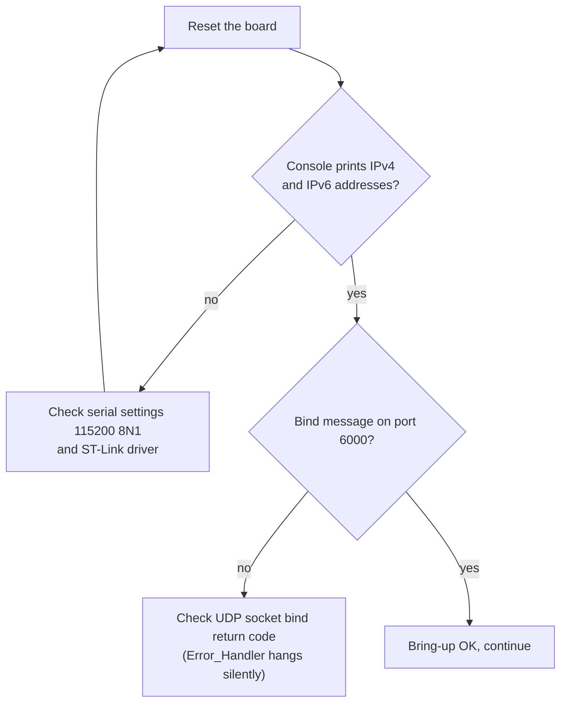
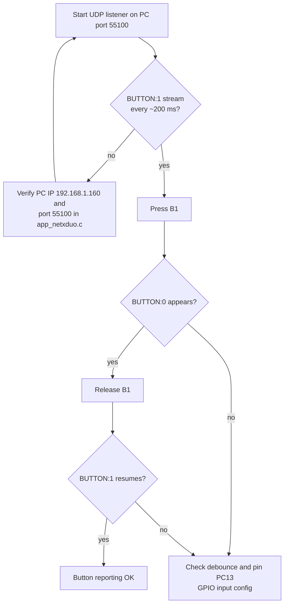
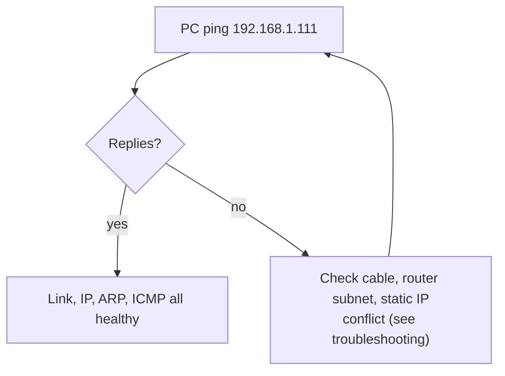

# Testing

A repeatable procedure to verify the firmware end to end: console output,
UDP reception over IPv4 and IPv6, LED control, and button reporting.

---

## 1. Prerequisites

* Board flashed and running (see [BUILDING.md](BUILDING.md)).
* Serial terminal open on the ST-Link Virtual COM port, 115200 8N1.
* The board and the test PC on the same network segment.
* Board IPv4 and IPv6 addresses edited to match your network
  (see [CONFIGURATION.md](CONFIGURATION.md)).
* A UDP listener on the PC bound to port 55100 (Packet Sender Server mode,
  `nc -u -l 55100`, or a small Python script).

---

## 2. Test 1: console bring-up

| Step | Action | Expected |
|:-----|:-------|:---------|
| 1 | Power cycle or reset the board | Console shows the banner within a second |
| 2 | Watch the first lines | `Device IPv4 Address: 192.168.1.111` (or your edited value) |
| 3 | Continue watching | `Device IPv6 Address: 2600:1702:4eb2:9780:0:0:0:abcd` (or your edited value) |
| 4 | Check the bind message | `UDP Server listening on PORT 6000..` |



---

## 3. Test 2: UDP command over IPv4

| Step | Action | Expected |
|:-----|:-------|:---------|
| 1 | Packet Sender: UDP, host `192.168.1.111`, port `6000` | |
| 2 | Send `LED ON` | Green LED LD1 lights; console shows the payload then `LED turned ON by command` |
| 3 | Send `LED OFF` | LED turns off; console shows `LED turned OFF by command` |
| 4 | Send `ON` | LED lights (bare token path) |
| 5 | Send `OFF` | LED turns off (bare token path) |
| 6 | Send `hello` | LED unchanged; console echoes `hello` |

---

## 4. Test 3: UDP command over IPv6

| Step | Action | Expected |
|:-----|:-------|:---------|
| 1 | Packet Sender: UDP, host `2600:1702:4eb2:9780::abcd`, port `6000` | |
| 2 | Send `LED_ON` | LED lights, console echo + command message |
| 3 | Send `LED_OFF` | LED turns off |

Note: IPv6 unicast routing through consumer routers is not universal. If the
PC is on the same LAN and the router does not route IPv6, connect the PC to the
same switch with link-local scope, or test IPv6 from a machine with a global
address in the same /64. See [TROUBLESHOOTING.md](TROUBLESHOOTING.md).

---

## 5. Test 4: button reporting

| Step | Action | Expected |
|:-----|:-------|:---------|
| 1 | Start the PC listener on UDP 55100 | |
| 2 | Leave B1 untouched | Listener receives `BUTTON:1` roughly every 200 ms |
| 3 | Press and hold B1 | Listener receives `BUTTON:0`, console shows `Sent: BUTTON:0` |
| 4 | Release B1 | Listener receives `BUTTON:1` again |
| 5 | Press quickly several times | Debounce accepts changes; each accepted change is followed by steady reports |



---

## 6. Test 5: ARP and link sanity (optional)

On the PC, check the board is reachable at layer 2/3:

```bash
ping 192.168.1.111          # ICMPv4, NetX replies (nx_icmp_enable)
ping -6 2600:1702:4eb2:9780::abcd   # ICMPv6 (nxd_icmp_enable), if routed
```



---

## 7. Full test matrix

| # | Test | Steps | Pass criteria |
|:-:|:-----|:------|:--------------|
| 1 | Console bring-up | 2.1 to 2.4 | addresses + bind message |
| 2 | IPv4 LED on | send `LED ON` | LD1 on, console confirms |
| 3 | IPv4 LED off | send `LED OFF` | LD1 off, console confirms |
| 4 | IPv4 bare tokens | send `ON`, `OFF` | LED follows |
| 5 | IPv4 unknown payload | send `hello` | echo only, LED unchanged |
| 6 | IPv6 LED on | send `LED_ON` | LD1 on |
| 7 | IPv6 LED off | send `LED_OFF` | LD1 off |
| 8 | Button report | press/release B1 | `BUTTON:0` / `BUTTON:1` on port 55100 |
| 9 | Report cadence | observe listener | steady ~200 ms stream |
| 10 | Ping IPv4 | `ping 192.168.1.111` | replies |
| 11 | Ping IPv6 | `ping6 ...::abcd` | replies (network dependent) |

---

## 8. Sample console transcript

```
Device IPv4 Address: 192.168.1.111
Device IPv6 Address: 2600:1702:4eb2:9780:0:0:0:abcd
UDP Server listening on PORT 6000..
Sent: BUTTON:1
Sent: BUTTON:1
LED ON
LED turned ON by command
Sent: BUTTON:1
Sent: BUTTON:0
Sent: BUTTON:0
LED OFF
LED turned OFF by command
```

If anything in this matrix fails, walk through
[TROUBLESHOOTING.md](TROUBLESHOOTING.md) before opening an issue.
