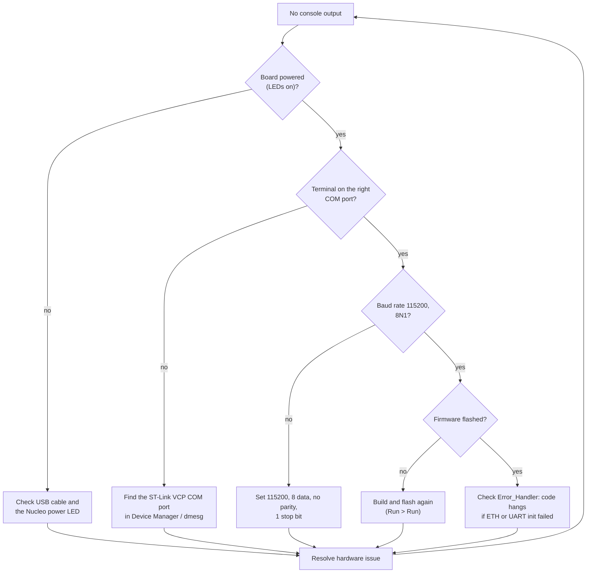
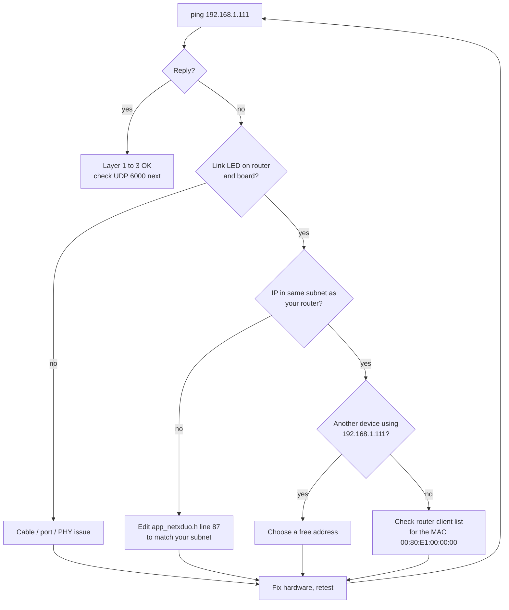
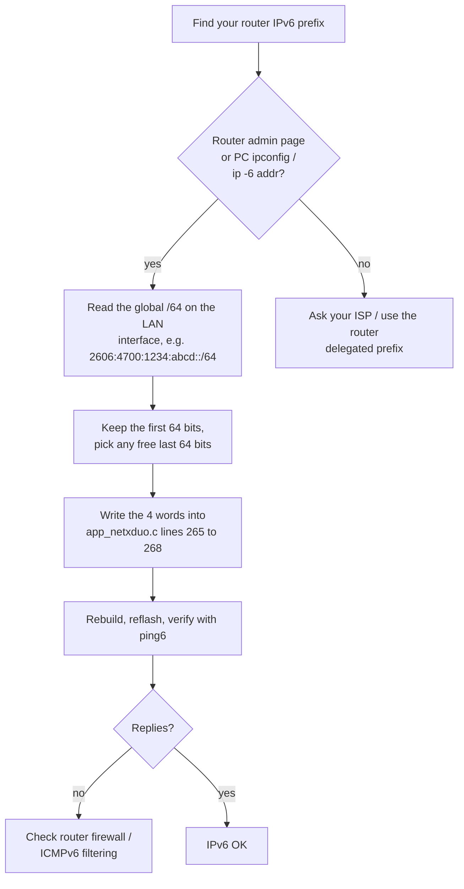
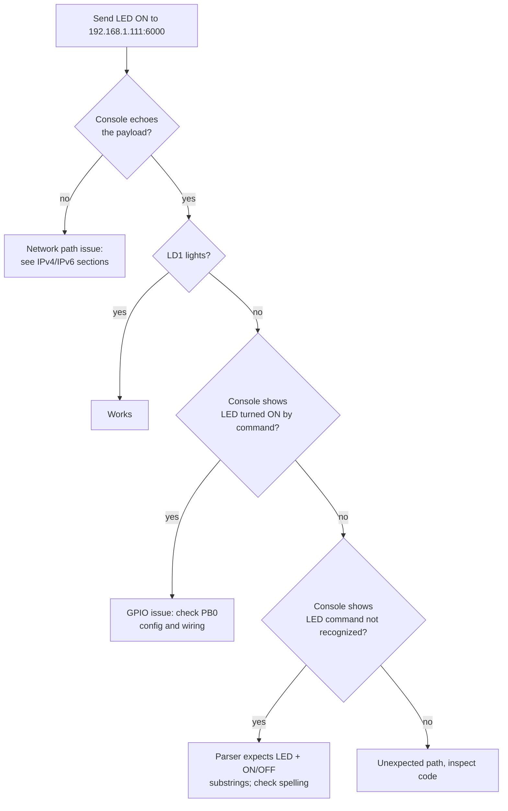

# Troubleshooting

Common problems, root causes, and fixes for this example. The two most
frequent failures are network related because the firmware uses **static**
IPv4 and IPv6 addresses.

---

## 1. No serial output at all

Possible causes: wrong COM port, wrong baud, firmware not flashed, or an
`Error_Handler()` hang during `MX_ETH_Init` / `MX_USART3_UART_Init`.

---

## 2. IPv4 packets do not arrive

| Symptom | Likely cause | Fix |
|:--------|:-------------|:----|
| `ping 192.168.1.111` fails | static IP not in your subnet | change `NX_APP_DEFAULT_IP_ADDRESS` (app_netxduo.h line 87) to a free address in your router subnet |
| | IP conflict with another device | pick another address, verify with `arp -a` |
| | link is down | check cable, router port LEDs |
| | firewall on the PC | allow UDP 6000 / ICMP on the PC |
| Packet Sender sends but console silent | wrong port | use port 6000 |
| | host unreachable ARP | confirm both devices on the same VLAN/subnet |

### IPv4 reachability flowchart

---

## 3. IPv6 packets do not arrive

The IPv6 global address `2600:1702:4eb2:9780::abcd/64` is hard-coded for the
original developer's router. On your network it almost certainly needs to be
changed.

| Symptom | Likely cause | Fix |
|:--------|:-------------|:----|
| IPv6 ping fails from PC | board's /64 does not match your router's prefix | find your router prefix (see below), edit app_netxduo.c lines 265 to 268 |
| | router does not route the /64 | enable IPv6 routing / use a prefix delegated to the LAN |
| | DAD disabled, duplicate suffix | pick a unique interface ID in the last 64 bits |
| IPv6 shows but no global address | router has no IPv6 WAN | use link-local for LAN testing |
| Packet Sender cannot resolve host | literal address must be entered with `::` | use `2600:1702:4eb2:9780::abcd` |

### How to pick a working IPv6 address

Computing the words: the address `2606:4700:1234:abcd:0:0:0:5678` maps to
words `0x26064700`, `0x1234abcd`, `0x00000000`, `0x00005678`.

---

## 4. Ethernet link never comes up

* The board uses RMII with the on-board LAN8742 PHY. Check the PHY reset and
  clock: RMII_REF_CLK (PA1) must be present.
* Verify the MPU region 1 is still configured when you change the linker
  script; the descriptors must stay in non-cacheable RAM_D2.
* `MX_ETH_Init` configures the MAC but the driver (`nx_stm32_eth_driver`)
  performs the actual PHY bring-up at `nx_ip_create` time. If `nx_ip_create`
  returns an error, the firmware hangs in `Error_Handler()` with no console
  output. Check your pool size: `NX_APP_MEM_POOL_SIZE` must cover the packet
  pool plus 2 KB + 2 KB stacks plus 1 KB ARP cache.

---

## 5. LED does not respond to commands

| Symptom | Likely cause | Fix |
|:--------|:-------------|:----|
| Command echoed but LED unchanged | payload not matched by parser | send `LED ON` / `LED OFF` or bare `ON` / `OFF` |
| Nothing echoed either | packets not reaching the app thread | check port 6000 and IP routing (sections 2 and 3) |
| LED stuck on | previous command left it on | send `LED OFF`; state persists by design |

---

## 6. Button reports missing or noisy

| Symptom | Likely cause | Fix |
|:--------|:-------------|:----|
| No `BUTTON:` messages | PC not listening on 55100 | start the UDP listener first |
| | PC IP changed | update line 306 (`192.168.1.160`) |
| | wrong port | update line 365 (`55100`) |
| Flickering values | mechanical bounce | increase `STABLE_THRESHOLD` (line 330) |
| Reports too fast/slow | `SEND_SLEEP_TICKS` (line 331) | raise/lower; 20 ticks = 200 ms |

---

## 7. Random resets or crashes

* **Stack overflow**: the application thread has a 2 KB stack; `snprintf`
  buffers are 64 bytes and the RX buffer 512 bytes, which fit, but if you add
  code, increase `NX_APP_THREAD_STACK_SIZE` and the pool accordingly.
* **Pool exhaustion**: if you send faster than the network drains, the packet
  pool (10 packets) can run dry; `send_udp_message` drops the packet on
  `NX_NO_PACKET`. Increase `NX_APP_PACKET_POOL_SIZE` (app_netxduo.h line 75).
* **MPU changes**: keep RAM_D2 descriptors non-cacheable.

---

## 8. Still stuck?

1. Reproduce with the exact commands in [TESTING.md](TESTING.md).
2. Capture the full serial console output and your Packet Sender settings.
3. Check the `.ioc` pin assignments match the board.
4. If the issue is in ST component code, use the ST Community for
   STM32-related questions; see [CONTRIBUTING.md](../CONTRIBUTING.md) for how
   issues and pull requests are handled here.
